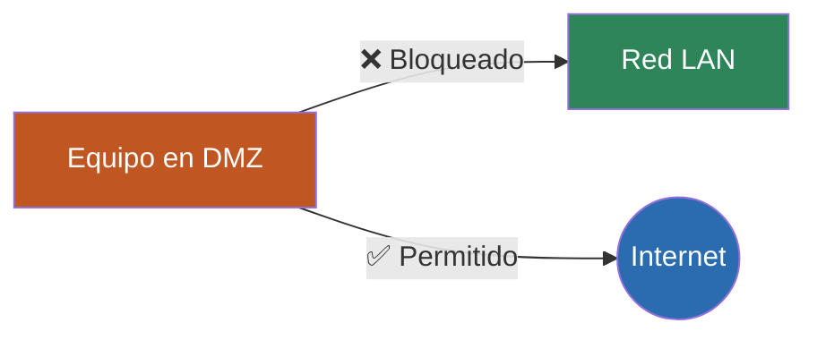

# Parte teórica de la fase

## Introducción

En esta fase se amplía la arquitectura del laboratorio mediante la creación de una zona desmilitarizada o DMZ.

El objetivo es separar los sistemas expuestos de la red interna, creando diferentes niveles de confianza y controlando la comunicación entre ellos mediante el firewall.

La segmentación de red es una medida fundamental de seguridad, ya que permite limitar el alcance de un posible compromiso.

---

## Concepto de DMZ

Una DMZ es una red intermedia utilizada para alojar sistemas o servicios que necesitan estar más expuestos que los equipos de la red interna.

### ¿Por qué utilizar una DMZ?

Permite:

- separar servicios expuestos de la LAN
- reducir el movimiento lateral
- aplicar reglas específicas de firewall
- limitar el impacto de un sistema comprometido

---

## Segmentación mediante OPNsense

OPNsense permite crear interfaces independientes para cada segmento de red.

En el laboratorio se utilizan:

- WAN → conexión externa
- LAN → red interna
- OPT1/DMZ → red de servicios expuestos

El firewall controla qué tráfico puede circular entre estas redes.

---

## Reglas de firewall

Las reglas permiten definir qué comunicaciones están autorizadas o bloqueadas.

En esta fase se aplica principalmente:

- DMZ → LAN: bloqueado
- DMZ → Internet: permitido



El orden de las reglas es importante, ya que el firewall evalúa el tráfico según las políticas configuradas.

---

## Comandos utilizados

### ip a

```bash
ip a
```

Permite comprobar la dirección IP asignada a la máquina de la DMZ.

### ping

```bash
ping <IP>
```

Permite comprobar si existe conectividad entre diferentes sistemas.

Se utiliza para verificar que la DMZ puede acceder a Internet pero no puede alcanzar la LAN.

---

## Problemas que se resuelven

- redes sin segmentación
- acceso innecesario entre sistemas
- movimiento lateral
- exposición de la red interna

---

## Errores comunes

- reglas de firewall en orden incorrecto
- interfaz OPT1 mal configurada
- gateway incorrecto
- reglas demasiado permisivas

---

## Cómo detectar errores

- comprobar conectividad mediante ping
- revisar las reglas de OPNsense
- consultar los logs del firewall
- verificar las direcciones IP

---

## Cómo solucionarlos

- revisar la configuración de interfaces
- comprobar el orden de las reglas
- verificar origen y destino de cada regla
- revisar gateway y direccionamiento

---

## Qué se aprende

- concepto de DMZ
- segmentación de red
- reglas de firewall
- control de tráfico
- principio de mínimo privilegio

---

## Relación con el mundo real

Las DMZ se utilizan en infraestructuras empresariales para separar servicios potencialmente expuestos de los sistemas internos de la organización.
