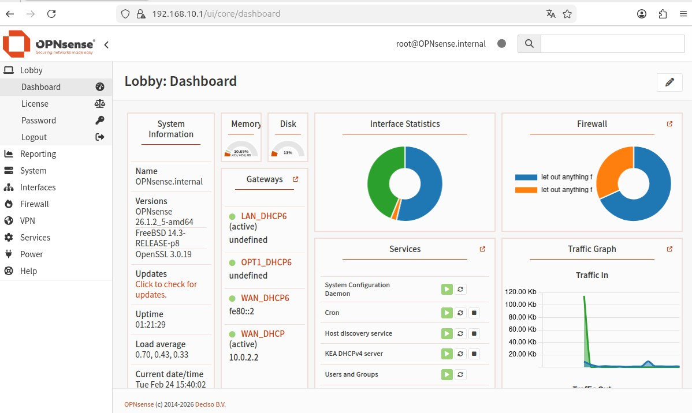
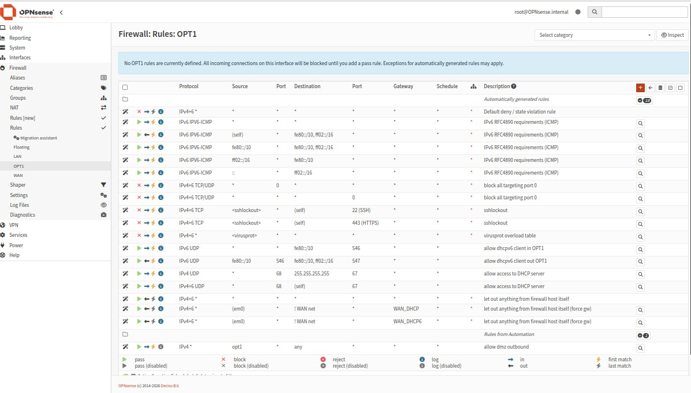
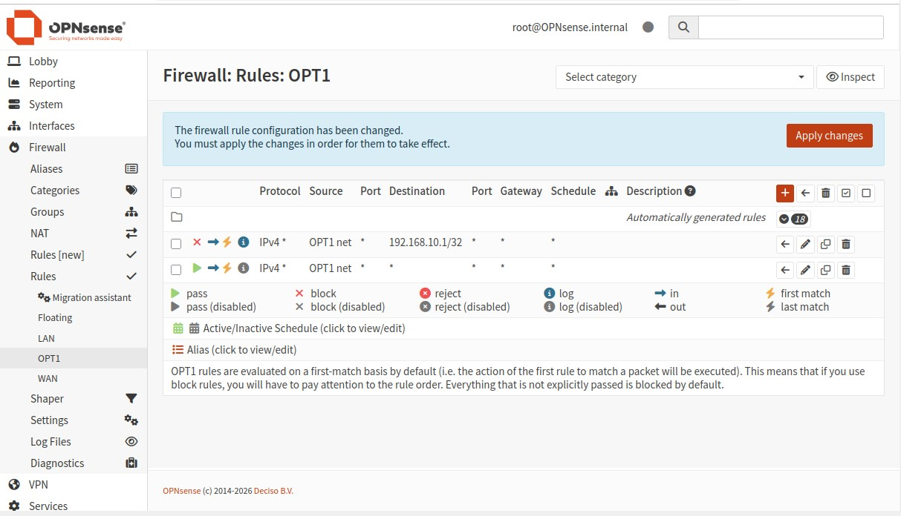

# Phase 2 – Despliegue de DMZ y Segmentación de Red

## 1. Objetivo

El objetivo de esta fase fue ampliar la arquitectura inicial del laboratorio mediante la creación de una **zona desmilitarizada (DMZ)** controlada por el firewall OPNsense.

Los objetivos específicos fueron:

- Crear una nueva red 192.168.20.0/24
- Asignarla a una interfaz dedicada del firewall (OPT1)
- Conectar una máquina virtual Ubuntu a esta red
- Permitir salida a Internet desde la DMZ
- Bloquear completamente el tráfico DMZ → LAN
- Validar la segmentación mediante pruebas reales y logs del firewall

Con esta fase, el laboratorio deja de ser una red plana y pasa a tener una arquitectura segmentada real.

---

## 2. Arquitectura resultante

| Zona | Red | Gateway | Descripción |
|------|------|----------|-------------|
| WAN | 10.0.2.0/24 | DHCP (NAT VirtualBox) | Salida a Internet |
| LAN | 192.168.10.0/24 | 192.168.10.1 | Red interna confiable |
| DMZ (OPT1) | 192.168.20.0/24 | 192.168.20.1 | Red semi-expuesta |

---

## 3. Evidencias y validación técnica

---

### 3.1 Estado inicial del firewall (antes de cambios)

Se documenta el estado del dashboard antes de modificar las reglas de la DMZ.

Esto permite comparar el comportamiento antes y después de aplicar la segmentación.

---

### 3.2 Reglas iniciales en OPT1 (antes de modificación)

Se revisan las reglas existentes en la interfaz OPT1 (DMZ).

En este punto no existía una restricción específica que impidiera la comunicación hacia la LAN.

---

### 3.3 Creación de regla de bloqueo DMZ → LAN

Se crea una regla en OPNsense con los siguientes parámetros:

- Interfaz: OPT1  
- Acción: Block  
- Dirección: in  
- Versión IP: IPv4  
- Protocolo: any  
- Origen: OPT1 net  
- Destino: LAN net  
- Quick: activado  

Esta regla impide que cualquier equipo en la DMZ pueda iniciar conexiones hacia la red LAN.

---

### 3.4 Orden final de reglas (evaluación first-match)

El firewall OPNsense evalúa las reglas en orden descendente (first-match).

Orden final:

1. BLOCK OPT1 → LAN  
2. PASS OPT1 → any  

Este orden garantiza que el tráfico hacia la LAN sea bloqueado antes de permitir salida general a Internet.

---

### 3.5 Validación mediante logs del firewall

Se realiza una prueba ICMP desde la máquina en DMZ hacia la puerta de enlace de la LAN (192.168.10.1).

El log del firewall muestra:

- Interfaz: OPT1  
- Protocolo: ICMP  
- Acción: block  

Esto confirma que la política de seguridad está siendo aplicada correctamente.

---

### 3.6 Prueba de conectividad negativa (DMZ → LAN)

Desde la máquina en DMZ:

ping 192.168.10.1

Resultado: fallo de comunicación.

---

### 3.7 Prueba de conectividad positiva (DMZ → Internet)

Desde la máquina en DMZ:

ping 8.8.8.8

Resultado: comunicación exitosa.

---

## 4. Troubleshooting (Incidencias y resolución)

Durante la implementación de la segmentación se detectaron las siguientes incidencias:

### 4.1 Regla de bloqueo sin efecto inicial

Inicialmente, la regla DMZ → LAN no producía el efecto esperado debido al orden de evaluación de reglas.

**Causa:**  
Existía una regla permisiva que permitía tráfico saliente desde OPT1 hacia cualquier destino.

**Solución aplicada:**  
- Reordenar las reglas colocando el bloqueo por encima de la regla permisiva.  
- Aplicar cambios.  
- Reiniciar la tabla de estados (Reset State Table).  

---

### 4.2 Estados persistentes en el firewall

Tras modificar las reglas, el tráfico seguía funcionando debido a estados activos previos.

**Causa:**  
El firewall mantiene conexiones activas aunque la regla cambie.

**Solución aplicada:**  
- Acceso a: Firewall → Diagnostics → States  
- Ejecución de "Reset State Table"  

---

### 4.3 Validación final mediante logs

Se activó el logging en la regla de bloqueo para confirmar que el tráfico ICMP era bloqueado correctamente en la interfaz OPT1.

---

## 5. Resultado final de la fase

✔ DMZ 192.168.20.0/24 desplegada  
✔ DHCP operativo en OPT1  
✔ Salida a Internet validada  
✔ Comunicación DMZ → LAN bloqueada  
✔ Logs confirman aplicación de reglas  

La arquitectura del laboratorio ahora cuenta con segmentación real entre zonas.

---

## 6. Conclusión técnica

La implementación de la DMZ introduce un modelo de seguridad basado en zonas, donde:

- La LAN representa la red confiable  
- La DMZ representa una red semi-expuesta  
- El firewall controla estrictamente el tráfico intersegmento  

Esta base permitirá en fases posteriores:

- Publicar servicios en la DMZ  
- Implementar reglas más restrictivas  
- Integrar IDS/IPS  
- Añadir monitoreo y SIEM  
