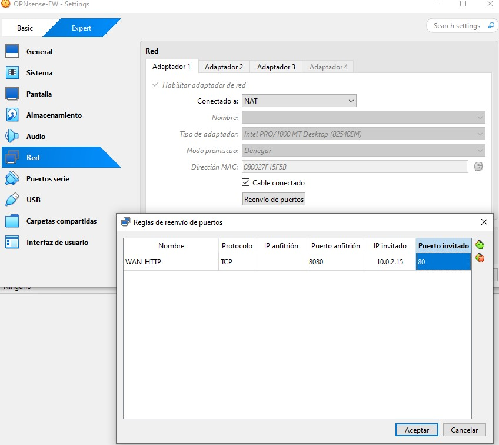

# Phase 3 – Publicación básica de servicio en DMZ

## 1. Objetivo

En esta fase se publica un servicio web alojado en la red DMZ hacia la interfaz WAN del firewall OPNsense.

Objetivos específicos:

- Exponer un servidor Nginx en la DMZ (192.168.20.100)
- Configurar Port Forward (80 → 192.168.20.100)
- Validar el flujo completo del tráfico
- Confirmar recepción en logs
- Aplicar restricciones básicas en WAN
- Documentar troubleshooting real

---

## 2. Arquitectura utilizada

| Zona | Red | IP relevante | Descripción |
|------|------|-------------|-------------|
| WAN | 10.0.2.0/24 | 10.0.2.15 | NAT VirtualBox |
| LAN | 192.168.10.0/24 | 192.168.10.1 | Red interna |
| DMZ | 192.168.20.0/24 | 192.168.20.100 | Servidor Nginx |

---

## 3. Estado inicial

### 3.1 Dashboard antes de la publicación

### 3.2 Interfaces activas

---

## 4. Validación del servidor en DMZ

### 4.1 Servicio Nginx en ejecución

Verificación del servicio en la máquina DMZ:

sudo systemctl status nginx

---

### 4.2 Verificación IP del servidor

Prueba local:

curl localhost

---

### 4.3 Conectividad interna LAN → DMZ

Desde la máquina LAN:

curl 192.168.20.100

---

## 5. Configuración de publicación

### 5.1 Redirección en VirtualBox (8080 → 80)

Se configura NAT Port Forward en VirtualBox:

Host: 8080  
Guest: 80  

---

### 5.2 Creación de Port Forward en OPNsense

Firewall → NAT → Port Forward

Parámetros:

- Interface: WAN
- Protocol: TCP
- Destination Port: 80
- Redirect target IP: 192.168.20.100
- Redirect target Port: 80
- Firewall rule: Register rule

---

### 5.3 Regla WAN generada automáticamente

---

## 6. Validación externa

### 6.1 Acceso desde host (http://localhost:8080)

---

### 6.2 Validación en Live View

Filtro aplicado:

- Interface: WAN
- dst_port: 80

Se observa tráfico marcado como "rdr rule".

---

### 6.3 Confirmación en logs del servidor

En la máquina DMZ:

sudo tail -f /var/log/nginx/access.log

Se confirma recepción de solicitudes HTTP provenientes de la WAN.

---

## 7. Restricción básica de seguridad (Hardening inicial)

Se modifica la regla WAN para permitir únicamente acceso desde la IP del host (10.0.2.2/32).

Esto limita la exposición del servicio únicamente al entorno de laboratorio.

---

## 8. Troubleshooting (Incidencias reales)

### 8.1 Bloqueo por "Block private networks from WAN"

Síntoma:
El tráfico aparecía bloqueado en Live View.

Causa:
La opción "Block private networks" en WAN estaba interfiriendo con el tráfico proveniente del entorno NAT.

Solución:
Deshabilitar temporalmente la opción o ajustar la regla WAN manualmente.

---

### 8.2 Regla generada no editable

Síntoma:
La regla creada automáticamente no permitía edición avanzada.

Solución:
Eliminar la regla automática y crear una regla manual personalizada.

---

### 8.3 Estados persistentes

Tras modificar reglas, el tráfico seguía bloqueado.

Solución aplicada:

Firewall → Diagnostics → States  
Reset State Table

---

## 9. Resultado final de la fase

✔ Servicio Nginx publicado en DMZ  
✔ Port Forward funcional (WAN → DMZ)  
✔ Validación en Live View  
✔ Confirmación en access.log  
✔ Restricción básica aplicada  
✔ Troubleshooting documentado  

La arquitectura ahora permite publicación controlada de servicios en la DMZ.

---

## 10. Conclusión técnica

En esta fase se ha implementado una publicación básica de servicio mediante NAT y reglas de firewall en OPNsense.

Se ha validado:

- Traducción de destino (Destination NAT)
- Evaluación first-match en reglas WAN
- Flujo completo WAN → Firewall → DMZ
- Confirmación en logs de aplicación

El laboratorio ya permite exposición controlada de servicios y está listo para avanzar a la fase de Hardening y Seguridad Avanzada.