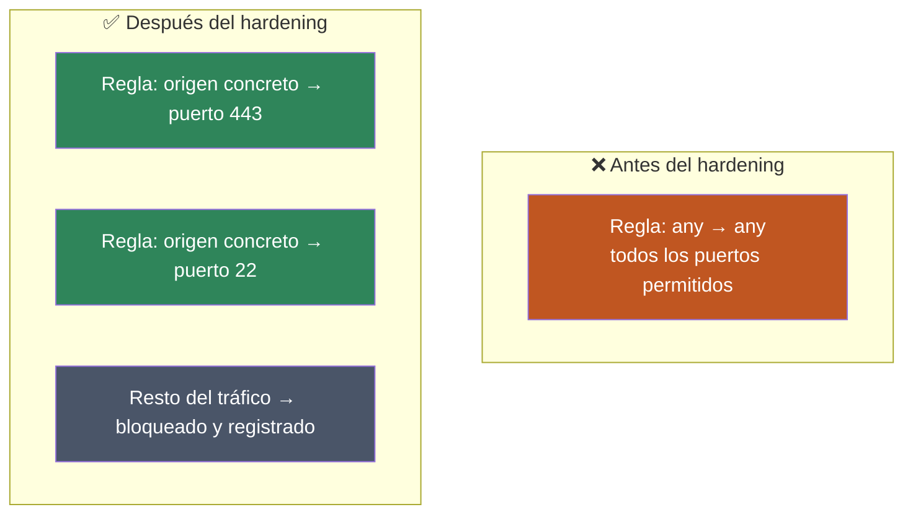

# Parte teórica de la fase

## Introducción

En esta fase se refuerza la seguridad de la red mediante técnicas de network hardening aplicadas sobre OPNsense.

El objetivo del hardening es reducir la superficie de ataque y eliminar configuraciones innecesariamente permisivas.

## Network Hardening

El hardening consiste en reforzar la configuración de un sistema para reducir las posibilidades de compromiso.

A nivel de red implica:

- restringir comunicaciones
- cerrar accesos innecesarios
- revisar reglas de firewall
- proteger interfaces administrativas
- registrar tráfico bloqueado

## Principio de mínimo privilegio

El principio de mínimo privilegio establece que únicamente debe permitirse el acceso estrictamente necesario.

Aplicado a un firewall significa evitar reglas excesivamente amplias y permitir únicamente los servicios requeridos.

## Hardening de OPNsense

En esta fase se revisan:

- reglas WAN
- reglas de DMZ
- acceso administrativo
- segmentación LAN/DMZ
- logs del firewall

Antes de realizar cambios importantes también es recomendable realizar una copia de seguridad de la configuración.

## Logs de firewall

Los logs permiten comprobar qué tráfico ha sido permitido o bloqueado.

Son importantes para:

- detectar errores
- investigar conexiones
- validar reglas
- analizar actividad sospechosa

## Problemas que se resuelven

- reglas demasiado permisivas
- exposición innecesaria
- movimiento lateral
- falta de visibilidad
- configuraciones inseguras

## Errores comunes

- bloquear tráfico legítimo
- permitir tráfico innecesario
- configurar reglas en orden incorrecto
- modificar el firewall sin realizar backup

## Cómo detectar errores

- revisar logs
- comprobar reglas
- realizar pruebas de conectividad
- validar servicios después de los cambios

## Cómo solucionarlos

- revisar origen y destino
- aplicar mínimo privilegio
- restaurar configuraciones si es necesario
- comprobar las reglas una por una

## Qué se aprende

- network hardening
- mínimo privilegio
- gestión segura de firewall
- análisis de logs
- validación de políticas de seguridad

## Relación con el mundo real

El hardening de firewalls es una tarea habitual en entornos empresariales para reducir la exposición de la infraestructura y limitar comunicaciones innecesarias.
