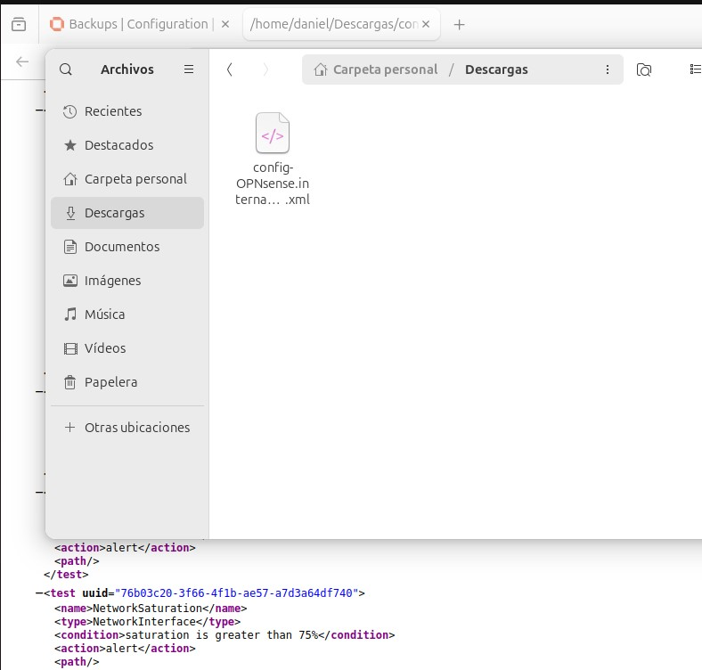
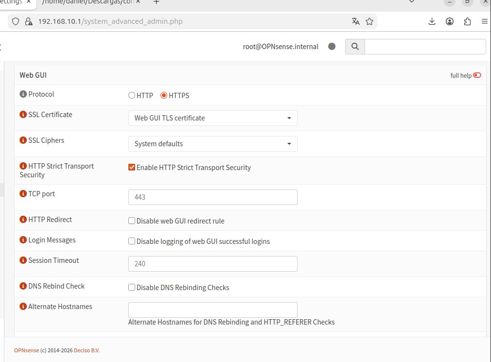
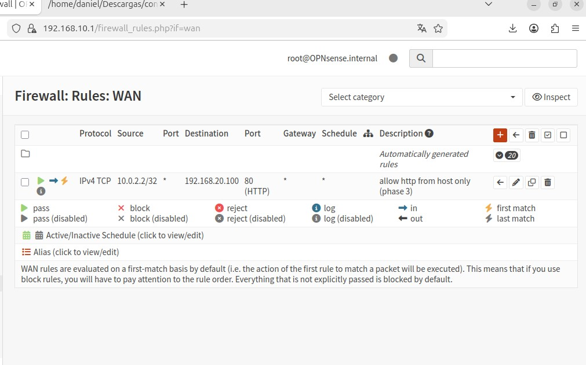
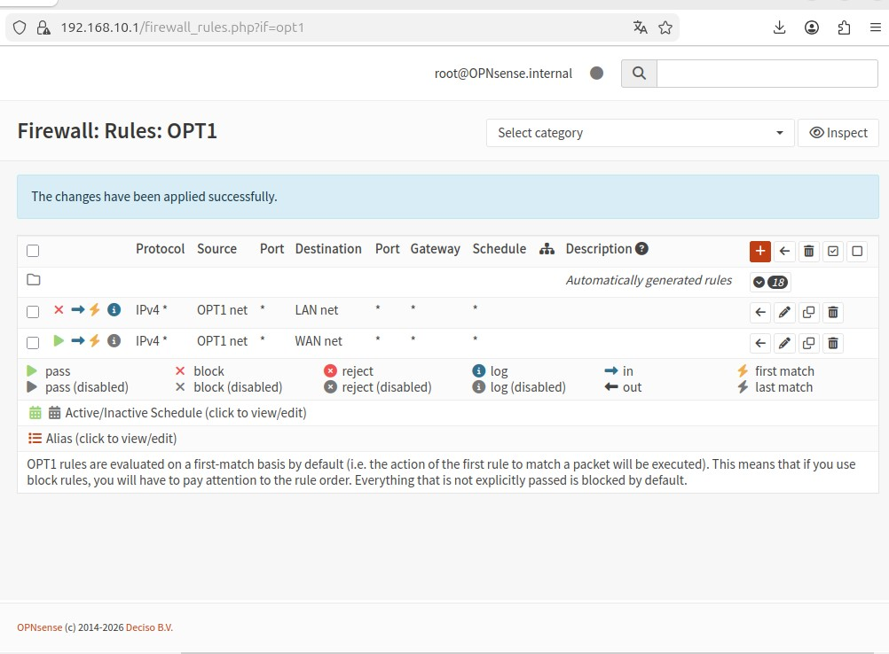
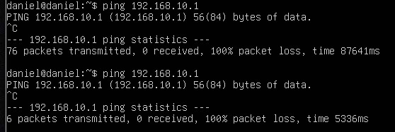
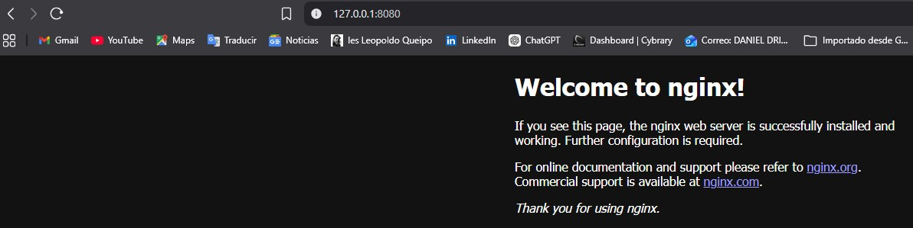
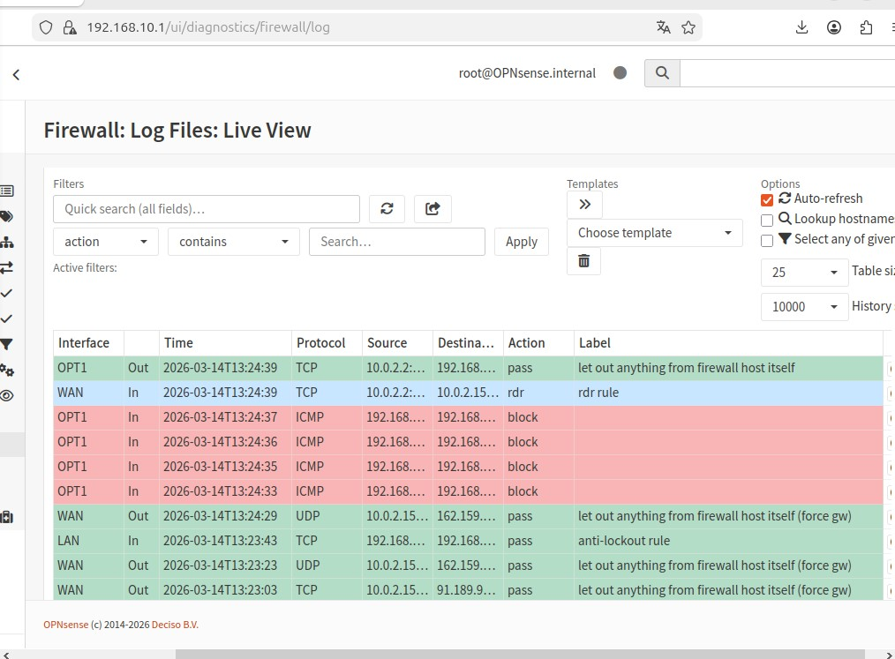
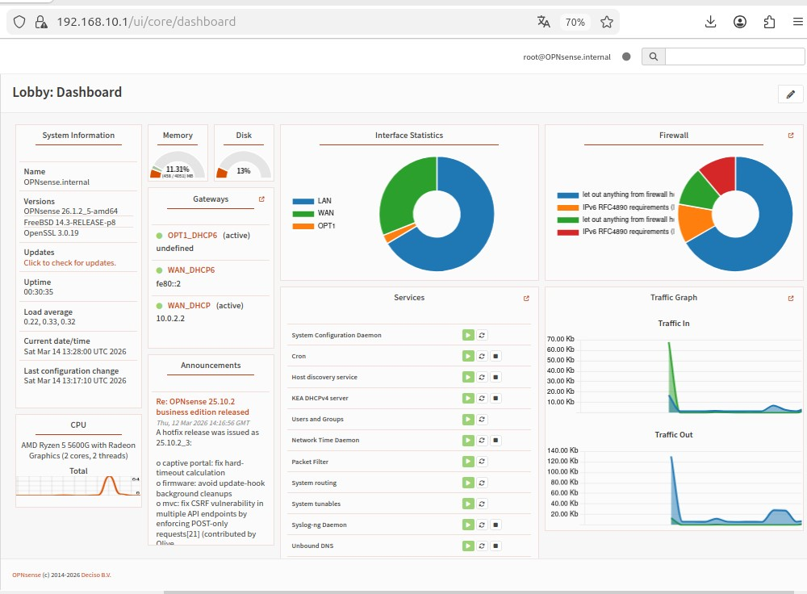
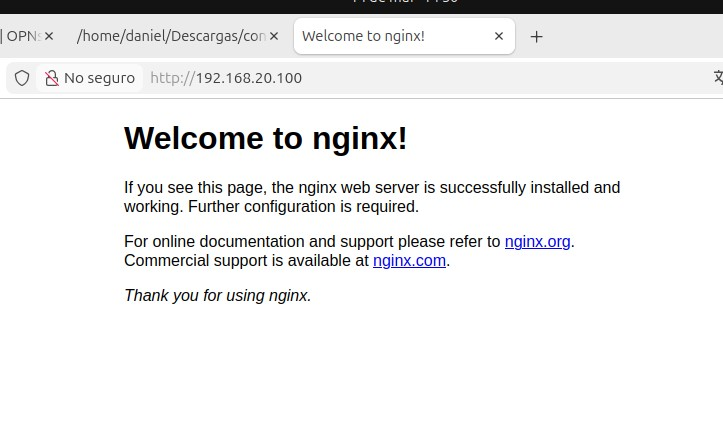

# Phase 4 — Network Hardening with OPNsense

## Objetivo

El objetivo de esta fase es reforzar la seguridad de la arquitectura de red implementada en el laboratorio mediante la aplicación de políticas de seguridad en el firewall OPNsense.

Se implementa un modelo de segmentación basado en zonas que separa la red interna (LAN) de la red expuesta (DMZ), aplicando el principio de **mínimo privilegio** para controlar el tráfico entre segmentos.

---

## Arquitectura de red

| Red | Rango | Descripción |
|----|----|----|
| WAN | 10.0.2.0/24 | Conectividad externa |
| LAN | 192.168.10.0/24 | Red interna |
| DMZ | 192.168.20.0/24 | Servidor expuesto |

| Host | IP | Función |
|-----|-----|-----|
| OPNsense | 192.168.10.1 | Firewall |
| Ubuntu LAN Client | 192.168.10.100 | Cliente interno |
| Ubuntu Server DMZ | 192.168.20.100 | Servidor web |

---

# Hardening aplicado

## 1. Backup de configuración

Antes de aplicar cambios en el firewall se realiza un backup completo de la configuración de OPNsense.

---

## 2. Hardening del panel de administración

Se configuran medidas de seguridad en la interfaz web del firewall:

- acceso mediante HTTPS
- cabeceras de seguridad
- refuerzo de configuración administrativa

---

## 3. Restricción de reglas WAN

Se revisan y restringen las reglas de acceso desde WAN para permitir únicamente el tráfico necesario hacia el servidor publicado.

---

## 4. Reglas de seguridad en la DMZ

Se refuerzan las reglas de la interfaz OPT1 (DMZ) para evitar el acceso desde la red expuesta hacia la red interna.

---

## 5. Verificación de segmentación

Se comprueba que el servidor ubicado en la DMZ no puede acceder a la red interna.

---

## 6. Validación del servicio web

A pesar de las restricciones aplicadas, el servidor web sigue ofreciendo el servicio HTTP correctamente.

---

## 7. Logs del firewall

Se revisan los logs de OPNsense para confirmar que el tráfico DMZ → LAN es bloqueado correctamente.

---

## 8. Estado final del firewall

Se verifica el estado final del firewall tras aplicar todas las medidas de hardening.

---

## 9. Validación desde la red LAN

Se confirma que la red interna sigue teniendo acceso al servidor publicado en la DMZ.

---

# Resultado

Tras aplicar las medidas de hardening:

- LAN → DMZ permitido
- DMZ → LAN bloqueado
- WAN → DMZ controlado
- tráfico supervisado por el firewall

La arquitectura resultante implementa un modelo básico de **segmentación de red segura**, utilizado habitualmente en entornos corporativos para proteger servicios expuestos.

## Conclusión

La aplicación de medidas de hardening en el firewall permite reforzar significativamente la seguridad de la arquitectura del laboratorio.

Mediante la correcta segmentación de red y la implementación de reglas restrictivas en OPNsense, se consigue:

- Aislar la red interna de los servicios expuestos en la DMZ.
- Limitar el tráfico permitido únicamente a los servicios necesarios.
- Registrar y monitorizar intentos de comunicación no autorizados.

Este enfoque reproduce un modelo de seguridad común en entornos empresariales donde los servicios públicos se ubican en una DMZ mientras que los sistemas internos permanecen protegidos detrás del firewall.