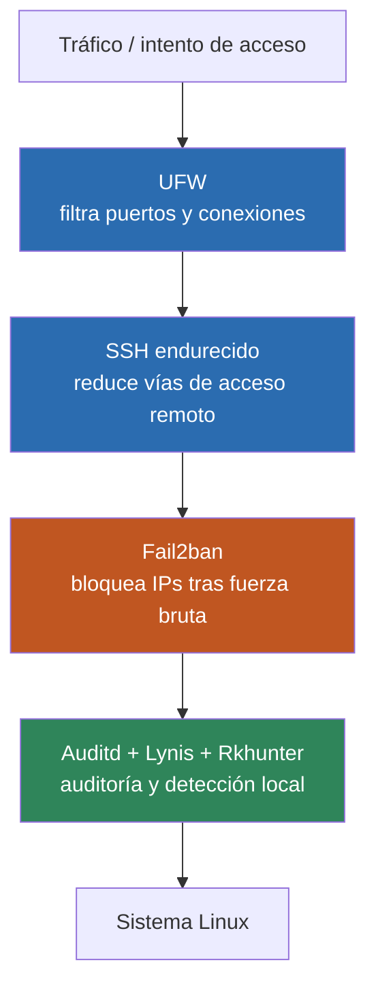

# Parte teórica de la fase

## Introducción

En esta fase se realiza el hardening del servidor Linux ubicado en la DMZ.

El objetivo es reducir la superficie de ataque del sistema operativo y aumentar su capacidad de prevención, auditoría y detección.

## System Hardening

El hardening de sistemas consiste en eliminar configuraciones inseguras y aplicar medidas destinadas a reducir las posibilidades de compromiso.

Entre las medidas utilizadas se encuentran:

- actualización del sistema
- firewall local
- endurecimiento de SSH
- auditoría
- protección contra fuerza bruta
- revisión de servicios y puertos



Cada capa cubre un tipo distinto de riesgo: si una falla o se salta, las siguientes siguen ofreciendo protección (defensa en profundidad).

## UFW

UFW es una interfaz simplificada para gestionar el firewall de Linux.

Permite definir qué conexiones pueden entrar o salir del sistema.

```bash
sudo ufw status
```

Permite comprobar las reglas activas.

## Fail2ban

Fail2ban analiza logs y puede bloquear temporalmente direcciones IP que presentan comportamientos sospechosos.

Es especialmente útil para proteger servicios como SSH frente a múltiples intentos de autenticación fallidos.

## Auditd

Auditd es el sistema de auditoría de Linux.

Permite registrar determinadas acciones realizadas en el sistema y proporciona información útil para investigaciones de seguridad.

## Lynis

Lynis es una herramienta de auditoría de seguridad para sistemas Unix/Linux.

Analiza la configuración del sistema y proporciona recomendaciones de hardening.

## Rkhunter

Rootkit Hunter permite comprobar determinados indicadores asociados a rootkits y configuraciones potencialmente sospechosas.

No sustituye a una solución EDR, pero resulta útil como herramienta complementaria de análisis.

## Hardening de SSH

SSH es un servicio crítico en servidores Linux.

Su configuración puede reforzarse mediante medidas como:

- limitar accesos
- evitar configuraciones inseguras
- controlar autenticaciones
- monitorizar intentos fallidos

## Problemas que se resuelven

- servicios innecesarios
- puertos expuestos
- configuraciones inseguras
- ataques de fuerza bruta
- falta de auditoría

## Errores comunes

- bloquear el propio acceso SSH
- reglas UFW incorrectas
- servicios innecesarios activos
- configuraciones SSH demasiado permisivas

## Cómo detectar errores

- revisar logs
- comprobar servicios
- analizar puertos abiertos
- ejecutar auditorías
- verificar reglas del firewall

## Cómo solucionarlos

- revisar configuraciones
- desactivar servicios innecesarios
- corregir reglas
- aplicar recomendaciones de auditoría

## Qué se aprende

- hardening Linux
- firewall local
- seguridad SSH
- auditoría
- protección contra fuerza bruta
- análisis de servicios

## Relación con el mundo real

El hardening de servidores es una medida básica de defensa utilizada para reducir la superficie de ataque antes de desplegar sistemas en entornos de producción.
