# Phase 5 — Linux Server Hardening

## Objetivo

El objetivo de esta fase es reforzar la seguridad del servidor Ubuntu desplegado en la red DMZ mediante la aplicación de diferentes técnicas de hardening a nivel de sistema operativo.

Se implementan herramientas de seguridad, auditoría y monitorización con el fin de reducir la superficie de ataque del servidor y mejorar la detección de posibles actividades maliciosas.

---

# Hardening aplicado

## 1. Actualización del sistema

Se actualiza el sistema operativo para garantizar que todos los paquetes cuentan con los últimos parches de seguridad disponibles.

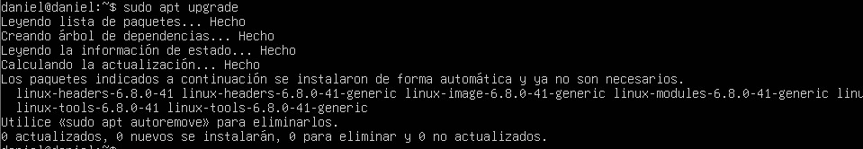

---

## 2. Instalación de herramientas de seguridad

Se instalan varias herramientas de seguridad que permitirán reforzar la protección del sistema y realizar auditorías posteriores.

Entre ellas se incluyen herramientas como **UFW, Fail2Ban, Lynis, RKHunter y Auditd**.

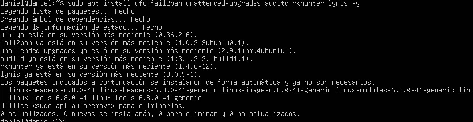

---

## 3. Activación del firewall UFW

Se habilita el firewall local del sistema mediante **UFW (Uncomplicated Firewall)** para controlar el tráfico entrante y saliente.

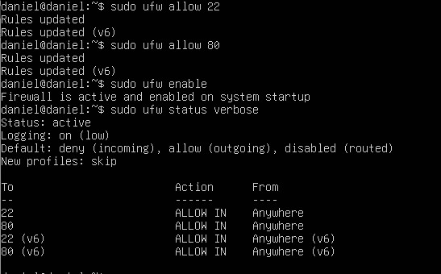

---

## 4. Activación de actualizaciones automáticas

Se habilita el sistema de **actualizaciones automáticas de seguridad**, permitiendo que el servidor reciba parches críticos sin intervención manual.

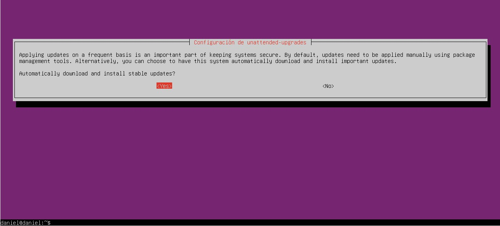

---

## 5. Verificación del servicio Auditd

Se verifica que el servicio **Auditd** se encuentra activo para registrar eventos relevantes del sistema y facilitar análisis de seguridad.

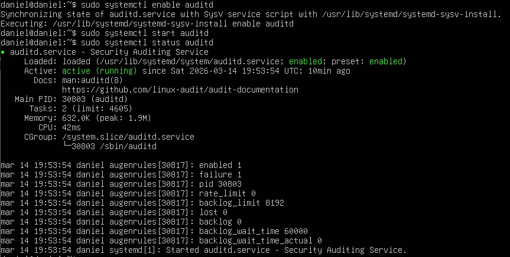

---

## 6. Auditoría de seguridad con Lynis

Se ejecuta una auditoría completa utilizando **Lynis** para analizar el estado de seguridad del sistema.

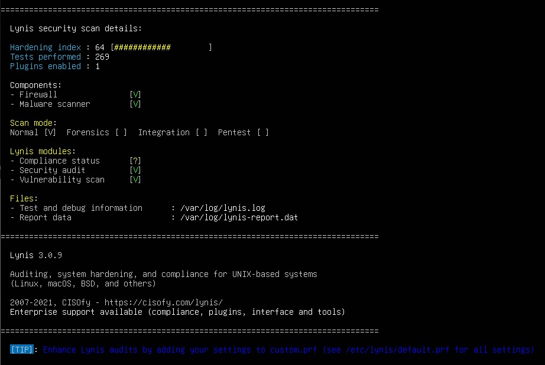

---

## 7. Hardening del servicio SSH

Se revisa la configuración del servicio SSH para aplicar medidas de seguridad adicionales, limitando accesos y reduciendo riesgos de ataques de fuerza bruta.

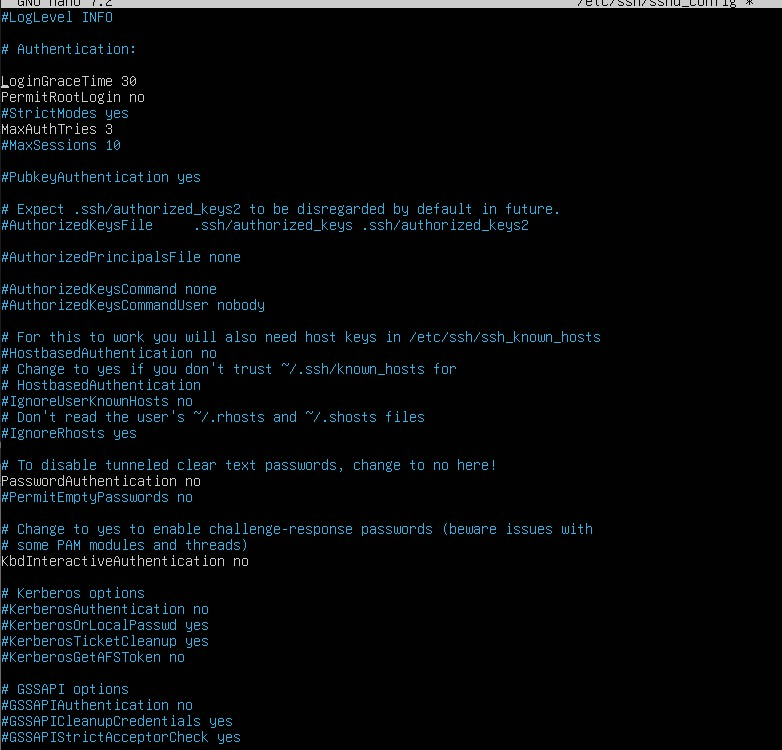

---

## 8. Verificación de Fail2Ban

Se confirma que el servicio **Fail2Ban** está activo y monitorizando los logs del sistema para bloquear intentos de autenticación sospechosos.

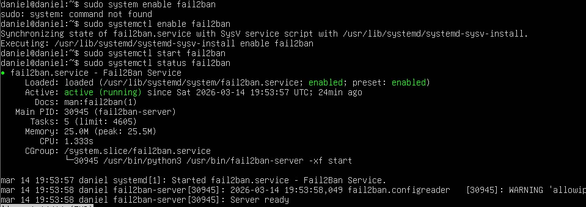

---

## 9. Escaneo de seguridad con RKHunter

Se ejecuta un análisis del sistema utilizando **RKHunter** para detectar posibles rootkits o modificaciones sospechosas.

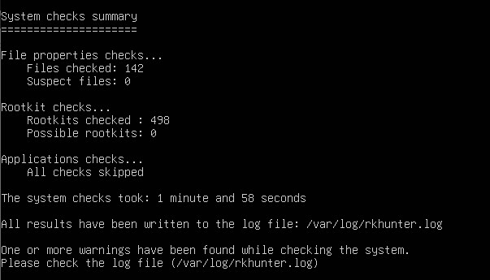

---

## 10. Verificación del firewall

Se revisa el estado del firewall UFW para comprobar que se encuentra activo y aplicando correctamente las reglas de seguridad.

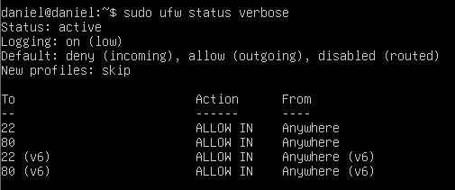

---

## 11. Revisión de logs de autenticación

Se revisan los logs de autenticación del sistema para identificar posibles intentos de acceso o eventos relacionados con el servicio SSH.

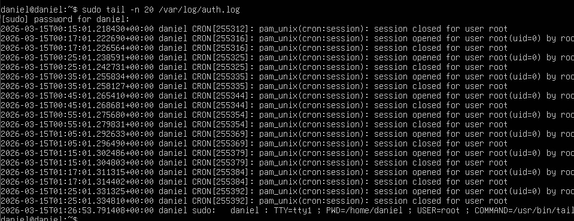

---

## 12. Verificación de puertos abiertos

Se revisan los puertos abiertos en el servidor para identificar qué servicios se encuentran escuchando en la red.

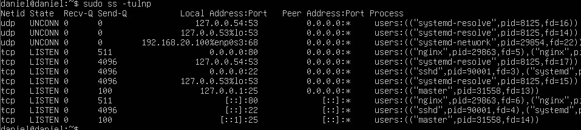

---

## 13. Auditoría adicional con Lynis

Se ejecuta nuevamente Lynis para verificar el estado de seguridad del sistema tras aplicar las medidas de hardening.

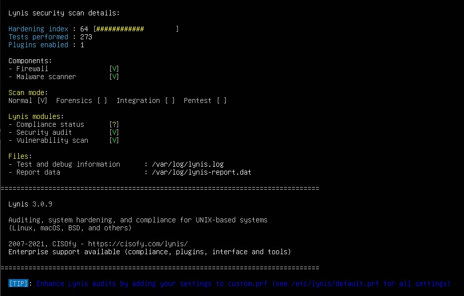

---

## 14. Actualización de base de datos de RKHunter

Se actualiza la base de datos de RKHunter para mejorar la detección de amenazas y mantener las firmas actualizadas.

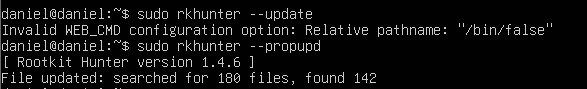

---

## 15. Escaneo de seguridad con RKHunter

Se realiza un escaneo completo del sistema utilizando RKHunter para verificar la integridad del sistema.

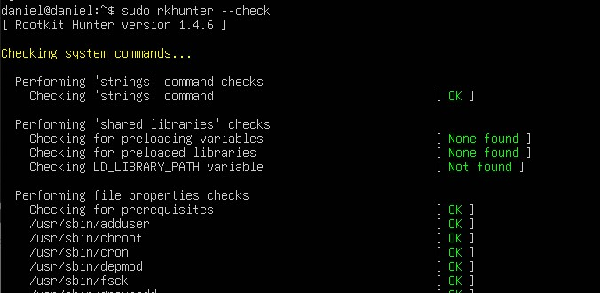

---

## 16. Revisión de resultados de RKHunter

Se revisan los resultados generados por RKHunter para comprobar si se detecta alguna amenaza o advertencia en el sistema.

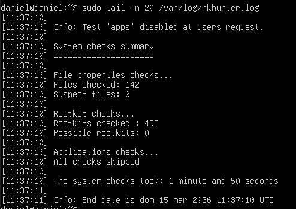

---

## 17. Verificación de servicios activos

Se revisan los servicios actualmente activos en el sistema para identificar posibles servicios innecesarios.

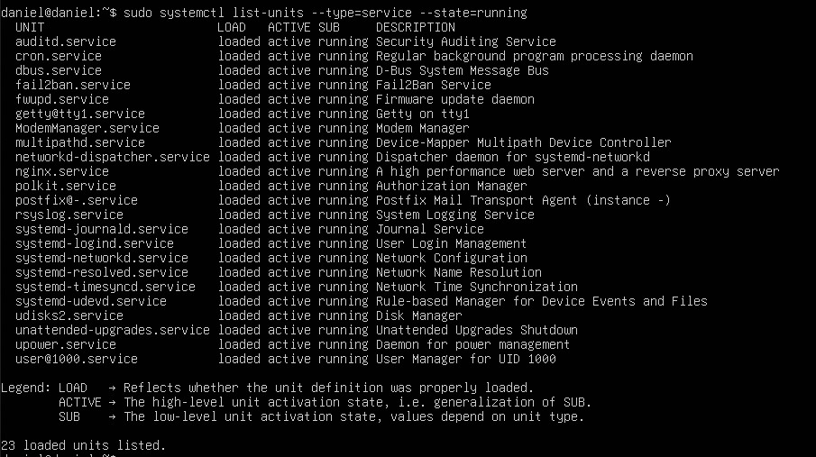

---

## 18. Verificación de puertos con ss

Se analiza qué procesos están utilizando los puertos abiertos mediante la herramienta ss.

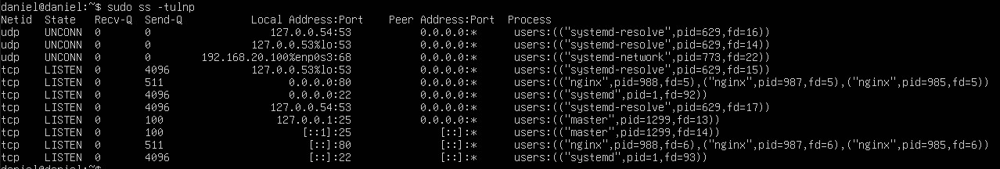

---

## 19. Revisión de usuarios del sistema

Se listan los usuarios existentes en el sistema para comprobar que no existen cuentas sospechosas.

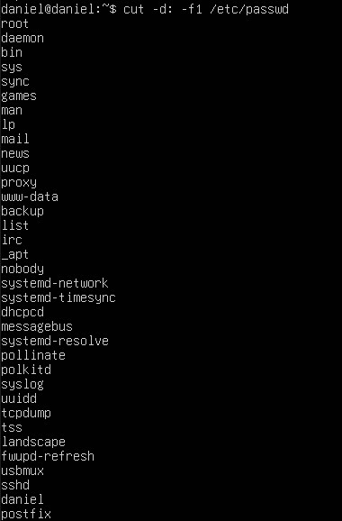

---

## 20. Revisión de grupos del sistema

Se analizan los grupos del sistema para verificar la correcta asignación de permisos.

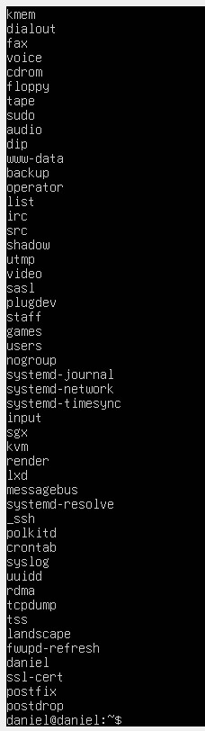

---

## 21. Verificación de intentos de login fallidos

Se revisan los logs del sistema para identificar intentos de autenticación fallidos.

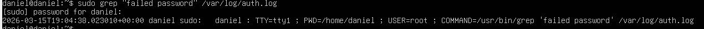

---

## 22. Verificación de herramientas instaladas

Se comprueba que las herramientas de seguridad instaladas están correctamente presentes en el sistema.

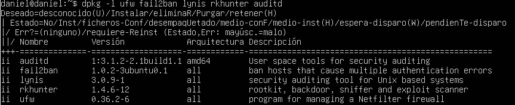

---

## 23. Revisión de reglas del firewall

Se revisan las reglas activas del firewall UFW para verificar que únicamente los servicios necesarios están permitidos.

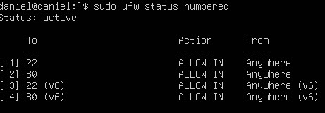

---

## 24. Verificación de configuración SSH

Se revisa nuevamente la configuración del servicio SSH para confirmar que las medidas de seguridad siguen activas.

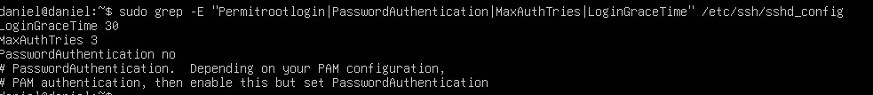

---

## 25. Índice de hardening de Lynis

Se revisa el índice de hardening generado por Lynis como indicador del nivel de seguridad del sistema.

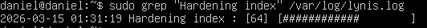

---

## 26. Verificación final de Fail2Ban

Se confirma que Fail2Ban continúa activo y protegiendo el sistema frente a ataques de autenticación.

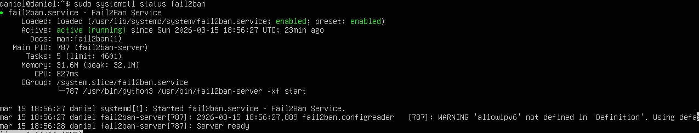

---

# Resultado

Tras aplicar las medidas de hardening, el servidor Ubuntu de la DMZ dispone de varias capas adicionales de seguridad que permiten mejorar significativamente su protección frente a ataques.

Entre las principales mejoras aplicadas destacan:

- firewall local activo mediante **UFW**
- protección frente a ataques de fuerza bruta con **Fail2Ban**
- auditoría de seguridad mediante **Lynis**
- detección de rootkits con **RKHunter**
- registro de eventos del sistema mediante **Auditd**
- configuración reforzada del servicio **SSH**

Estas medidas permiten reducir la superficie de ataque del servidor y mejorar su capacidad de monitorización.

---

## Conclusión

El hardening del servidor Linux constituye un paso fundamental dentro de la arquitectura de seguridad del laboratorio.

La aplicación de herramientas de auditoría, sistemas de monitorización y configuraciones seguras permite fortalecer el sistema operativo frente a posibles ataques y reproduce prácticas habituales utilizadas en entornos profesionales de ciberseguridad.

Este proceso complementa el hardening realizado previamente en la red mediante el firewall OPNsense, aportando una capa adicional de seguridad en el propio servidor expuesto.