# Phase 6 — Security Monitoring & Log Centralization

## Objetivo

El objetivo de esta fase es desplegar un servidor de monitorización dentro de la red LAN del laboratorio para comenzar a construir una arquitectura orientada a SOC / Blue Team.

Se implementa una base de visibilidad mediante la recopilación, análisis y centralización de logs procedentes de otros sistemas, permitiendo detectar eventos relevantes y preparar el entorno para futuras integraciones con SIEM.

---

## Arquitectura

| Red | Rango | Descripción |
|----|----|----|
| LAN | 192.168.10.0/24 | Red interna |
| DMZ | 192.168.20.0/24 | Servidor expuesto |

| Host | IP | Función |
|-----|-----|-----|
| OPNsense | 192.168.10.1 | Firewall |
| Ubuntu LAN Client | 192.168.10.100 | Cliente interno |
| Ubuntu Server DMZ | 192.168.20.100 | Servidor web |
| Security Monitor | 192.168.10.200 | Servidor de monitorización |

---

# Hardening aplicado

## 1. Configuración de red de la máquina de monitorización

Se configura la red de la máquina security-monitor en la red LAN para permitir la comunicación con el resto de sistemas del laboratorio.

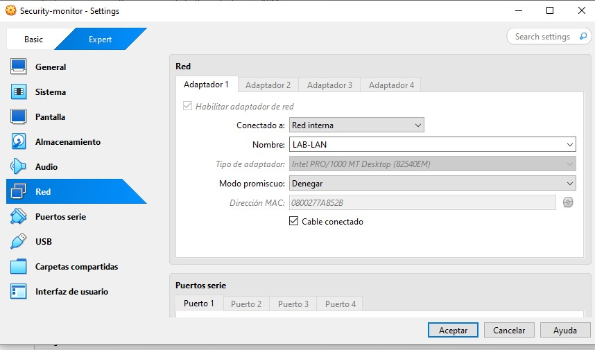

---

## 2. Verificación de dirección IP

Se comprueba que la máquina recibe correctamente la dirección IP asignada en la red LAN.

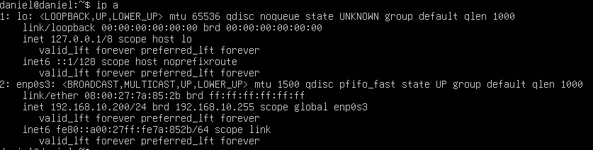

---

## 3. Validación de conectividad

Se verifica la conectividad con el firewall, cliente LAN y servidor DMZ para asegurar la correcta comunicación en la red.

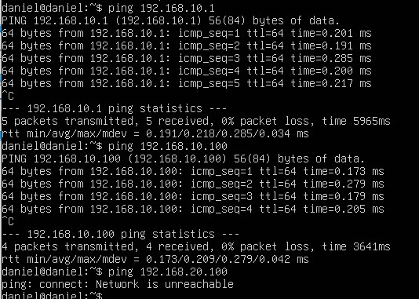

---

## 4. Actualización del sistema

Se actualiza el sistema operativo para garantizar que dispone de los últimos parches de seguridad.

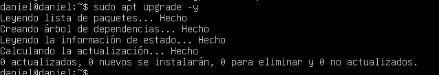

---

## 5. Instalación de herramientas de monitorización

Se instalan herramientas básicas de monitorización y análisis como rsyslog, htop, net-tools y tcpdump.

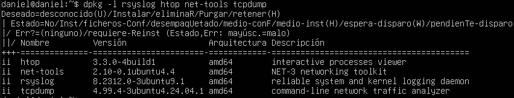

---

## 6. Verificación de servicios activos

Se comprueba que los servicios principales del sistema están en ejecución, incluyendo el servicio de logs.

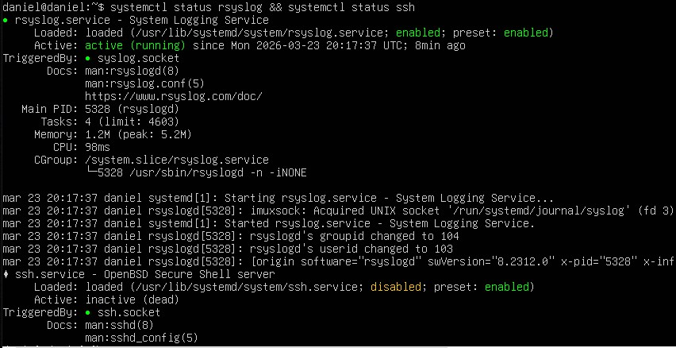

---

## 7. Monitorización de procesos

Se analizan los procesos activos del sistema para observar el consumo de recursos y actividad en tiempo real.

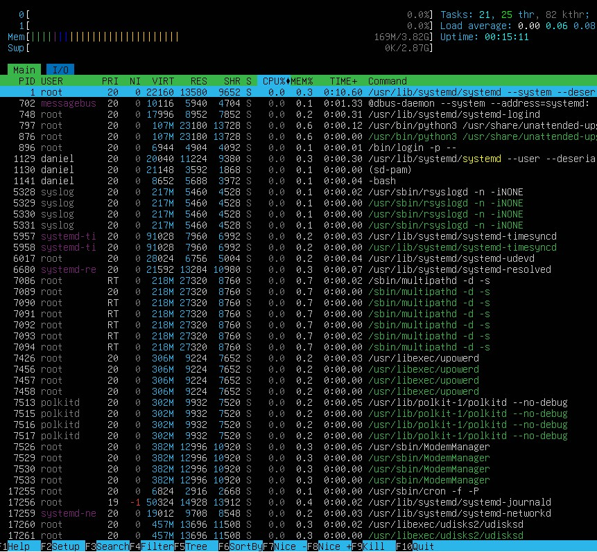

---

## 8. Captura de tráfico de red

Se realiza una captura de tráfico utilizando tcpdump para observar paquetes en la red.

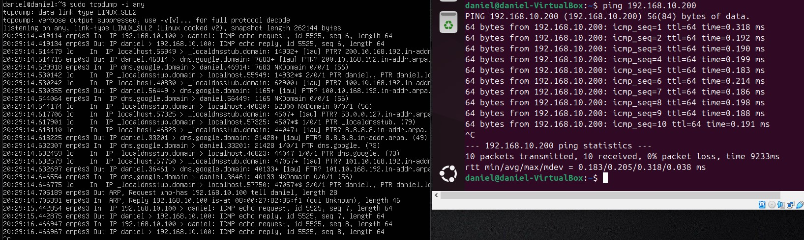

---

## 9. Revisión de logs del sistema

Se revisan los logs del sistema para analizar eventos recientes y actividad general del servidor.

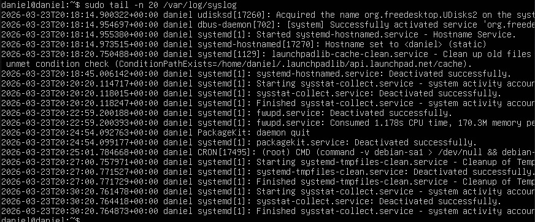

---

## 10. Revisión de logs de autenticación

Se analizan los logs de autenticación para identificar intentos de acceso y eventos relacionados con SSH.

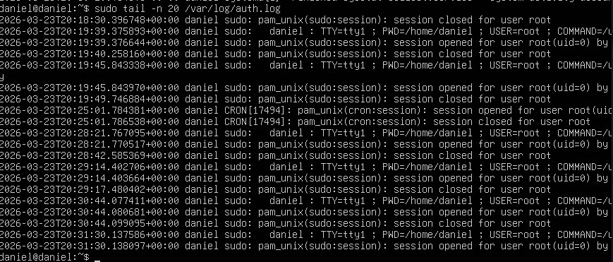

---

## 11. Verificación de conexiones activas

Se revisan las conexiones de red activas para identificar servicios y comunicaciones en curso.

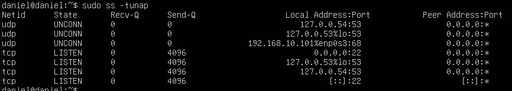

---

## 12. Análisis de interfaces de red

Se analizan las interfaces de red y estadísticas de tráfico para evaluar el flujo de datos.

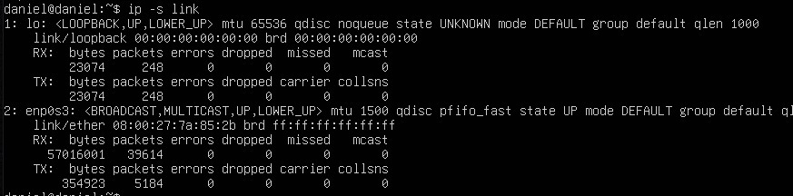

---

## 13. Procesos con mayor consumo

Se identifican los procesos con mayor uso de CPU para analizar el comportamiento del sistema.

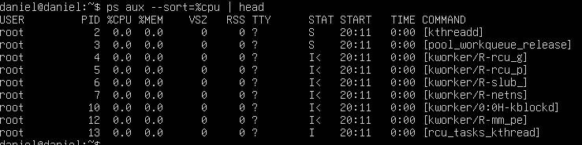

---

## 14. Configuración de rsyslog como servidor

Se configura el servidor de monitorización para recibir logs mediante el puerto 514.

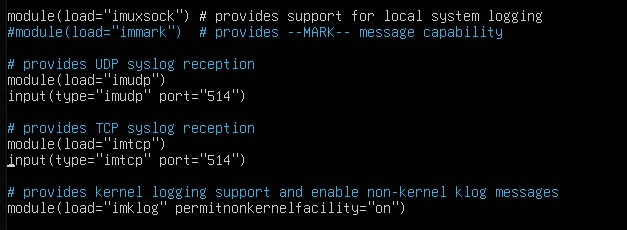

---

## 15. Verificación de puerto de escucha

Se comprueba que el servidor está escuchando correctamente en el puerto 514.

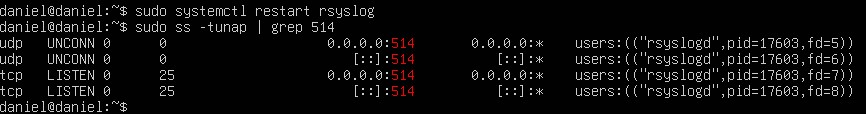

---

## 16. Configuración de envío de logs desde DMZ

Se configura el servidor DMZ para enviar logs al servidor de monitorización.

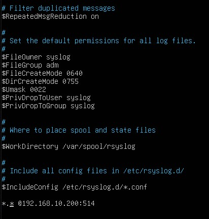

---

## 17. Verificación de recepción de logs

Se confirma que los logs enviados desde la DMZ son recibidos correctamente en el servidor de monitorización.

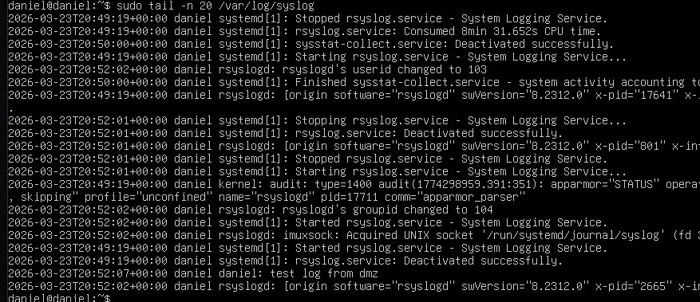

---

# Resultado

Tras la implementación de esta fase se ha desplegado un servidor de monitorización capaz de:

- centralizar logs desde otros sistemas
- analizar eventos del sistema y de red
- observar actividad en tiempo real
- establecer una base para detección de incidentes

Esto permite mejorar significativamente la visibilidad del entorno.

---

## Conclusión

La implementación de un servidor de monitorización constituye un paso clave en la evolución del laboratorio hacia un entorno orientado a SOC / Blue Team.

La centralización de logs y la capacidad de análisis de eventos permiten detectar comportamientos anómalos y establecer las bases para futuras integraciones con herramientas SIEM.

Esta fase transforma el laboratorio de un entorno únicamente defensivo a uno con capacidades reales de detección y monitorización.