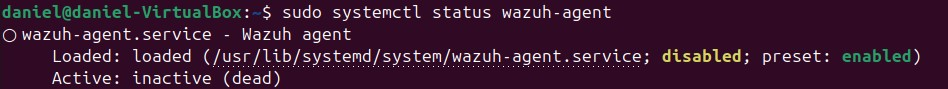
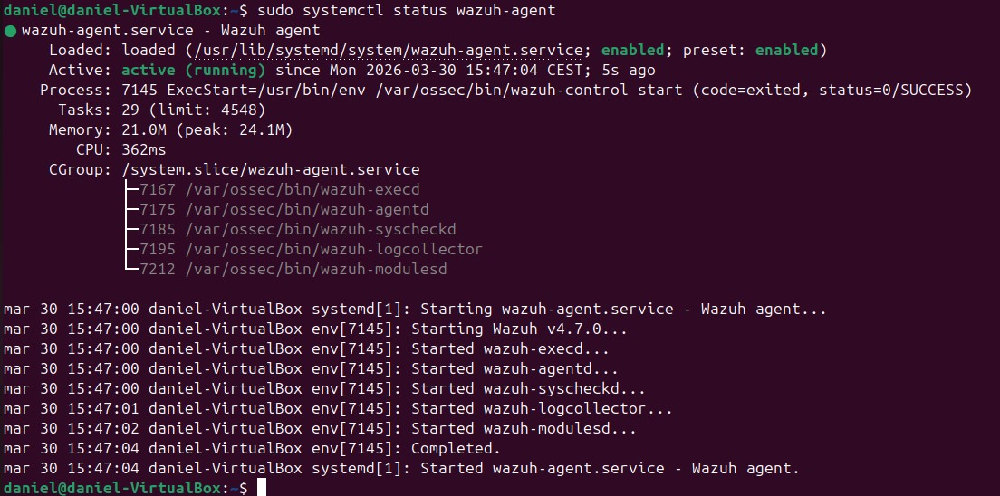
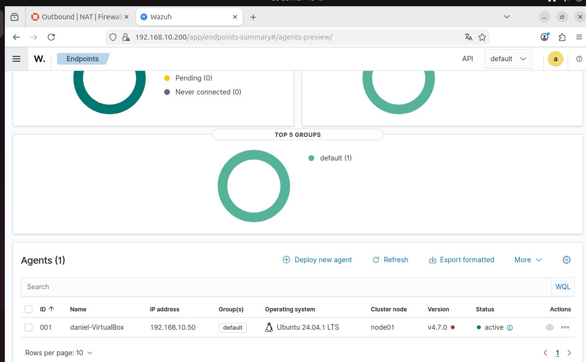
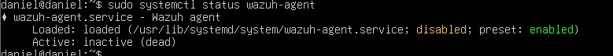
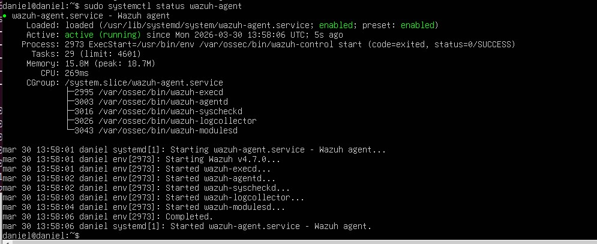
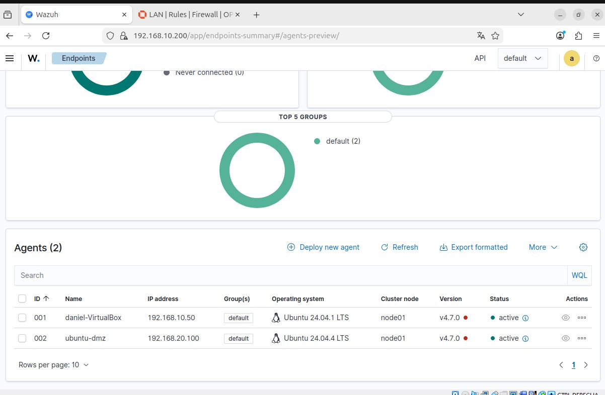

# Phase 8 — Wazuh Agents Deployment

## Objetivo

El objetivo de esta fase es desplegar agentes de Wazuh en las máquinas del laboratorio (LAN y DMZ) para comenzar a recopilar eventos reales desde los endpoints.

Esto permite integrar los sistemas en el SIEM y sentar las bases para la detección y análisis de eventos en fases posteriores.

---

## Arquitectura

| Red | Rango | Descripción |
|----|----|----|
| LAN | 192.168.10.0/24 | Red interna |
| DMZ | 192.168.20.0/24 | Red segmentada |

| Host | IP | Función |
|-----|-----|-----|
| Wazuh Manager | 192.168.10.200 | SIEM |
| Ubuntu LAN Client | 192.168.10.50 | Endpoint interno |
| Ubuntu Server DMZ | 192.168.20.100 | Servidor expuesto |

---

# Despliegue de agentes

## 1. Instalación del agente en máquina LAN

Se descarga e instala el agente de Wazuh en el cliente de la red LAN.

---

## 2. Activación del agente en LAN

Se inicia el servicio del agente y se verifica su estado.

---

## 3. Verificación en dashboard (LAN)

Se comprueba que el agente de la LAN aparece como activo en el SIEM.

---

## 4. Instalación del agente en máquina DMZ

Se repite el proceso de instalación en el servidor de la DMZ.

---

## 5. Activación del agente en DMZ

Se inicia el servicio del agente en la máquina DMZ.

---

## 6. Problema de conectividad en entorno segmentado

Durante la conexión del agente de la DMZ se detecta que este no aparece como activo en el dashboard.

Tras múltiples comprobaciones se identifican los siguientes puntos:

- El agente estaba correctamente instalado y ejecutándose
- El registro del agente se realizó correctamente
- Las reglas de firewall estaban configuradas aparentemente de forma correcta

Sin embargo, no existía conectividad real entre la red DMZ y la red LAN.

---

## 7. Análisis del problema

Se realiza un análisis detallado del comportamiento de red y se identifica la causa raíz:

El servidor Wazuh disponía de dos interfaces de red:

- Interfaz NAT (10.0.2.x)
- Interfaz LAN (192.168.10.x)

El sistema estaba utilizando la interfaz NAT como ruta por defecto, lo que provocaba que las respuestas hacia la red DMZ salieran por una interfaz incorrecta.

Esto generaba un problema de enrutamiento asimétrico, impidiendo la comunicación entre redes.

---

## 8. Solución aplicada

Se corrige la configuración de red del servidor Wazuh:

- Se fuerza el uso de la interfaz LAN como gateway principal
- Se deshabilita el uso de rutas en la interfaz NAT

Esto garantiza que todo el tráfico hacia la DMZ se enrute correctamente.

---

## 9. Resultado final

Tras la corrección del routing, ambos agentes (LAN y DMZ) aparecen correctamente como activos en el dashboard de Wazuh.

---

# Resultado

Tras la implementación de esta fase se ha conseguido:

- desplegar agentes en múltiples redes
- integrar endpoints en el SIEM
- centralizar logs en tiempo real
- detectar y solucionar un problema real de red

---

## Conclusión

La integración de agentes en entornos segmentados introduce desafíos reales relacionados con la conectividad y el routing.

Durante esta fase se ha identificado y resuelto un problema de enrutamiento asimétrico causado por la coexistencia de múltiples interfaces en el servidor SIEM.

Este tipo de incidencias es habitual en entornos reales y su resolución demuestra un conocimiento sólido en redes, segmentación y arquitectura SOC.

Esta fase marca el inicio de la visibilidad real del entorno, permitiendo avanzar hacia fases de detección y análisis de amenazas.