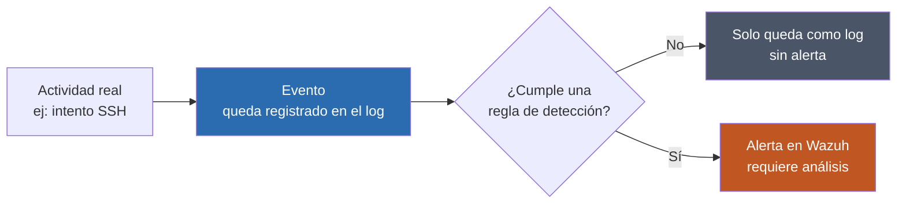

# Parte teórica de la fase

## Introducción

En esta fase se generan eventos de seguridad dentro del laboratorio para comprobar la capacidad de detección del entorno implementado.

El objetivo es pasar de una infraestructura únicamente monitorizada a un escenario donde se produce actividad real y posteriormente se analiza mediante Wazuh.

---

## Generación de eventos

Para comprobar un sistema de monitorización es necesario generar actividad que pueda quedar registrada.

En esta fase se utilizan eventos como:

- autenticaciones SSH correctas
- autenticaciones SSH fallidas
- múltiples intentos de acceso
- actividad de reconocimiento de red

---

## Autenticación SSH

SSH permite administrar sistemas de forma remota.

Los intentos de autenticación generan registros que pueden utilizarse para identificar accesos legítimos y comportamientos sospechosos.

---

## Ataques de fuerza bruta

Un ataque de fuerza bruta consiste en realizar múltiples intentos de autenticación con el objetivo de encontrar credenciales válidas.

Un único fallo puede ser legítimo.

Sin embargo, muchos intentos fallidos en un periodo corto pueden representar un comportamiento sospechoso.

---

## Reconocimiento de red

El reconocimiento consiste en recopilar información sobre sistemas, puertos y servicios disponibles.

Herramientas de escaneo permiten identificar posibles puntos de entrada antes de realizar otras acciones.

La visibilidad de este tipo de actividad depende de las fuentes de logs y de las reglas de detección disponibles.

---

## Detección mediante SIEM

Wazuh analiza los eventos recibidos desde los agentes.

La detección depende de:

- calidad de los logs
- configuración del agente
- reglas existentes
- contexto del evento
- frecuencia de la actividad

Un SIEM no detecta automáticamente cualquier comportamiento posible.

---

## Diferencia entre evento y alerta

Un evento es una acción registrada por un sistema.

Una alerta se genera cuando dicho evento cumple determinadas condiciones de detección.

Por tanto, disponer de logs no significa necesariamente que toda actividad genere una alerta.

---

## Análisis de eventos

El analista debe interpretar la información para determinar si una actividad es legítima o sospechosa.

Para ello puede analizar:

- dirección IP de origen
- usuario
- frecuencia
- hora
- sistema afectado
- tipo de evento

---

## Problemas que se resuelven

- SIEM sin validación práctica
- desconocimiento de la calidad de los logs
- falta de pruebas de detección
- ausencia de eventos reales para analizar

---

## Errores comunes

- esperar que toda actividad genere una alerta
- confundir logs con detecciones
- generar eventos en un sistema no monitorizado
- no comprobar el agente
- falta de logging adecuado

---

## Cómo detectar errores

- comprobar agentes Wazuh
- revisar eventos recibidos
- consultar logs locales
- verificar conectividad
- comparar actividad generada con eventos registrados

---

## Cómo solucionarlos

- revisar la configuración de logging
- comprobar los agentes
- validar la comunicación con Wazuh
- ajustar las fuentes de eventos cuando sea necesario

---

## Qué se aprende

- generación de eventos
- análisis de autenticaciones
- detección de actividad sospechosa
- diferencia entre logs y alertas
- funcionamiento práctico de un SIEM
- análisis básico desde perspectiva SOC

---

## Relación con el mundo real

Los equipos Blue Team realizan pruebas de detección para comprobar que las actividades relevantes quedan registradas y pueden ser investigadas por los analistas de seguridad.
