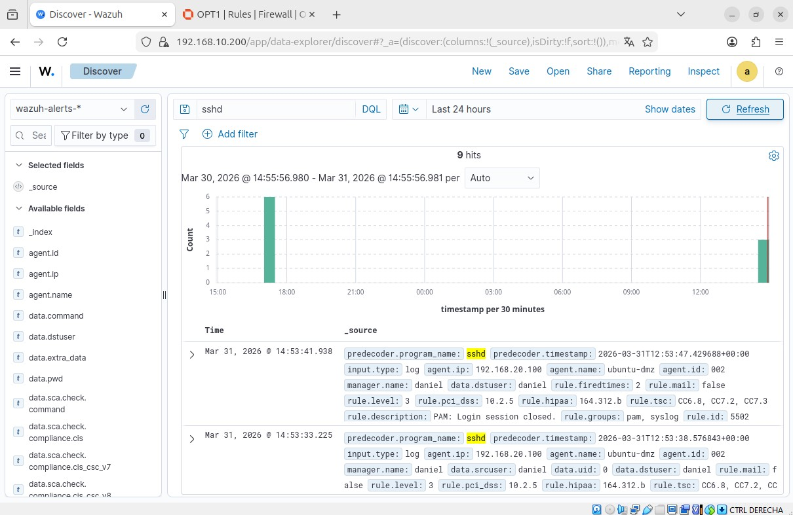
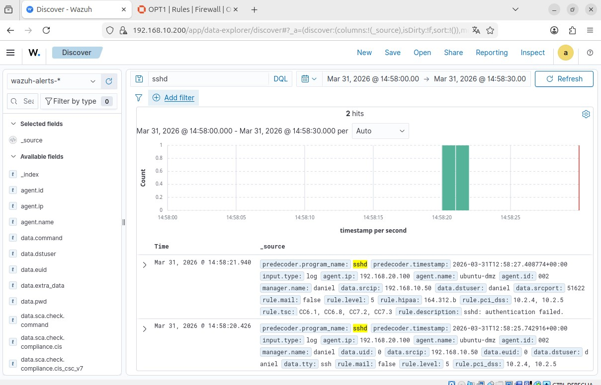
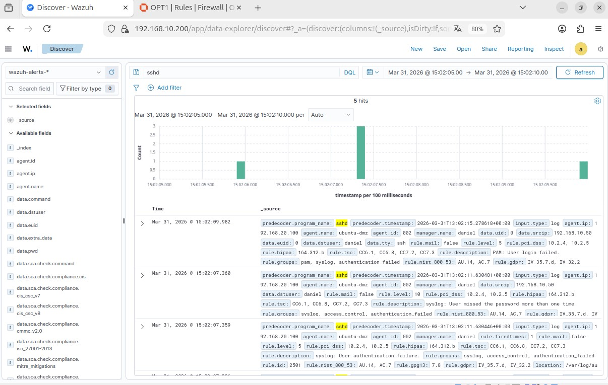
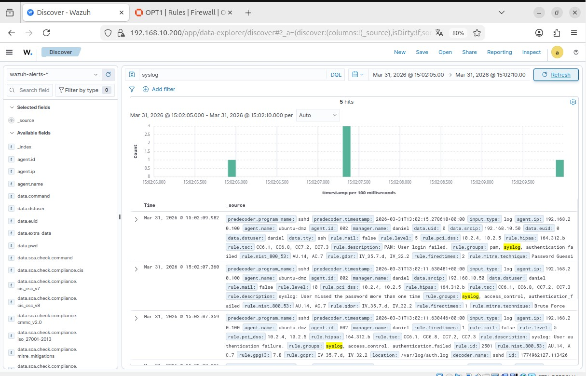

# Phase 9 — Event Generation & Detection

## Objetivo

El objetivo de esta fase es generar eventos reales dentro del laboratorio para validar la capacidad del SIEM (Wazuh) de detectar actividad relevante.

Se simulan distintos escenarios habituales en entornos reales, como autenticaciones válidas, intentos fallidos de acceso y patrones de ataque tipo fuerza bruta.

---

## Arquitectura

| Red | Rango | Descripción |
|----|----|----|
| LAN | 192.168.10.0/24 | Red interna |
| DMZ | 192.168.20.0/24 | Red segmentada |

| Host | IP | Función |
|-----|-----|-----|
| Wazuh Manager | 192.168.10.200 | SIEM |
| Ubuntu LAN Client | 192.168.10.50 | Origen de eventos |
| Ubuntu Server DMZ | 192.168.20.100 | Servidor monitorizado |

---

# Generación de eventos

## 1. Login SSH exitoso

Se realiza una conexión SSH válida desde la red LAN hacia el servidor en la DMZ.

Esto genera eventos de autenticación correcta en el SIEM.

---

## 2. Intentos de login fallidos

Se realizan varios intentos de autenticación incorrecta para simular accesos no autorizados.

Estos eventos permiten identificar patrones de fallo de autenticación.

---

## 3. Simulación de ataque de fuerza bruta

Se repiten múltiples intentos de login fallidos en un corto intervalo de tiempo.

Esto genera un patrón claro de ataque tipo brute force.

---

## 4. Actividad de red (escaneo)

Se ejecuta un escaneo de red contra el servidor de la DMZ.

Aunque Wazuh no detecta directamente la herramienta utilizada, sí se registra actividad en los logs del sistema.

---

# Análisis de eventos

Durante esta fase se han observado los siguientes comportamientos:

- autenticaciones válidas registradas correctamente
- intentos fallidos detectados con información de origen y usuario
- múltiples intentos en corto periodo identificados como patrón de ataque
- actividad de red reflejada en logs del sistema

---

# Limitaciones detectadas

Se ha identificado que:

- la ejecución de comandos no se registra por defecto
- la detección de escaneos requiere reglas específicas adicionales
- el SIEM depende de la configuración de logging del sistema

---

# Resultado

Tras la implementación de esta fase se ha conseguido:

- validar la ingesta de eventos reales en el SIEM
- simular escenarios habituales de ataque
- identificar patrones de autenticación sospechosa
- comprender las limitaciones de detección por defecto

---

## Conclusión

La generación de eventos permite validar el funcionamiento del SIEM en un entorno realista.

Se ha comprobado que Wazuh es capaz de detectar eventos de autenticación y patrones de ataque básicos, aunque requiere configuraciones adicionales para ampliar su capacidad de detección.

Esta fase representa el paso de un entorno pasivo a uno activo, donde se simulan comportamientos reales para su análisis.