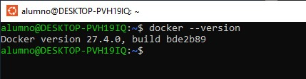
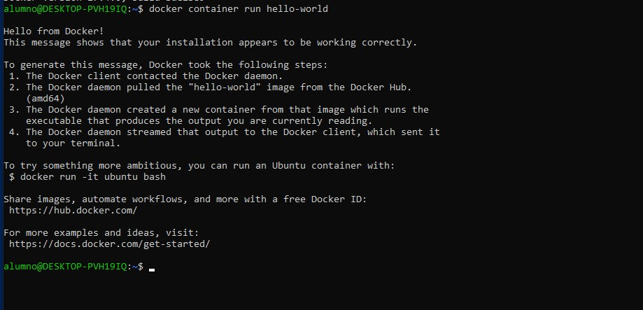
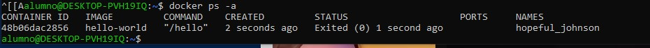
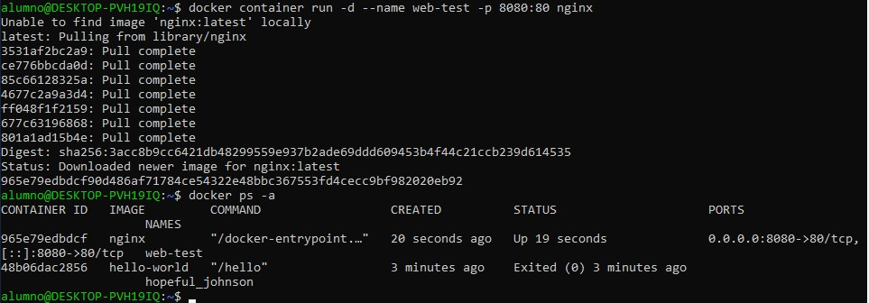
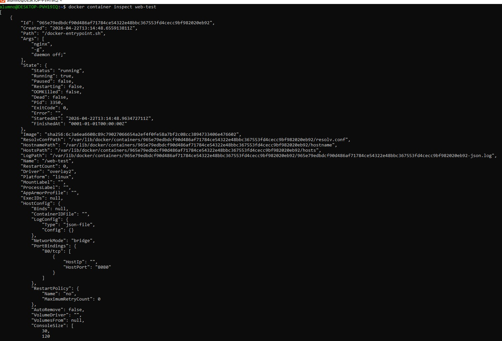
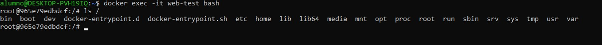
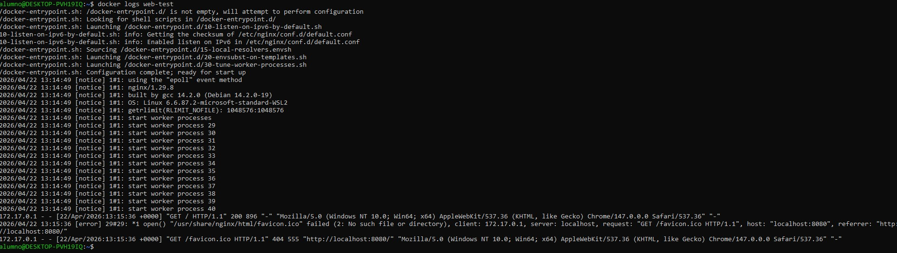
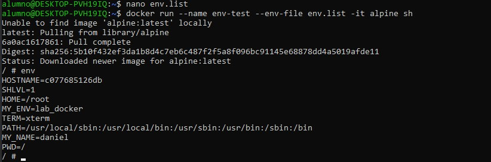

# Deployment — Docker Lab

## 1. Objetivo

El objetivo de este laboratorio es comprender el funcionamiento básico de Docker desde un punto de vista práctico, analizando cómo se crean, gestionan y utilizan contenedores en un entorno real.

Además, se busca entender cómo Docker abstrae la ejecución de aplicaciones mediante contenedores ligeros, facilitando su despliegue, portabilidad y aislamiento.

---

## 2. Introducción a Docker

Docker es una plataforma de virtualización ligera basada en contenedores que permite empaquetar una aplicación junto con todas sus dependencias en una unidad ejecutable.

A diferencia de las máquinas virtuales tradicionales, los contenedores no incluyen un sistema operativo completo, sino que comparten el kernel del sistema anfitrión, lo que los hace más eficientes en términos de recursos y más rápidos en su ejecución.

Esto permite:

- Desplegar aplicaciones de forma consistente en distintos entornos
- Aislar procesos sin necesidad de virtualización completa
- Reducir tiempos de despliegue
- Facilitar entornos de desarrollo y testing reproducibles

---

## 3. Arquitectura de Docker

Docker se basa en varios componentes clave:

- **Docker Engine**: motor principal que gestiona contenedores
- **Imágenes**: plantillas inmutables utilizadas para crear contenedores
- **Contenedores**: instancias en ejecución de una imagen
- **Docker Hub**: repositorio público de imágenes

El flujo habitual consiste en descargar una imagen desde Docker Hub y ejecutarla como contenedor.

---

## 4. Entorno de laboratorio

El laboratorio se ha realizado sobre un entorno Windows utilizando WSL (Windows Subsystem for Linux) con Ubuntu.

Docker se ha ejecutado mediante integración con Docker Desktop, permitiendo lanzar contenedores desde la terminal Linux.

---

## 5. Desarrollo del laboratorio

### 5.1 Verificación de Docker

Se ha comprobado que Docker está correctamente instalado y operativo mediante el comando correspondiente.

Evidencia:

Esta comprobación garantiza que el entorno está preparado para ejecutar contenedores.

---

### 5.2 Primer contenedor

Se ha ejecutado un contenedor de prueba utilizando la imagen oficial `hello-world`.

Evidencia:

Este contenedor verifica que Docker puede descargar imágenes desde Docker Hub y ejecutarlas correctamente.

---

### 5.3 Gestión de contenedores

Se ha utilizado el comando de listado para visualizar los contenedores existentes, tanto en ejecución como detenidos.

Evidencia:

Esto permite entender el ciclo de vida de un contenedor, que puede ejecutarse, detenerse y permanecer almacenado en el sistema.

---

### 5.4 Contenedor con servicio web

Se ha desplegado un contenedor basado en la imagen `nginx`, exponiendo un servicio web mediante mapeo de puertos.

Evidencias:

Este paso demuestra cómo una aplicación puede ejecutarse dentro de un contenedor y ser accesible desde el exterior.

---

### 5.5 Inspección del contenedor

Se ha utilizado el comando de inspección para analizar la configuración interna del contenedor.

Evidencia:

Se ha podido observar información relevante como direcciones IP internas, configuración de red y estado del contenedor.

---

### 5.6 Acceso al contenedor

Se ha accedido a la shell interna del contenedor mediante ejecución interactiva.

Evidencia:

Esto permite interactuar directamente con el entorno del contenedor, confirmando su aislamiento respecto al sistema anfitrión.

---

### 5.7 Monitorización de logs

Se han consultado los logs generados por el contenedor.

Evidencia:

Los logs son una herramienta fundamental para diagnosticar el comportamiento de aplicaciones en contenedores.

---

### 5.8 Uso de variables de entorno

Se ha lanzado un contenedor utilizando un fichero externo de variables de entorno.

Evidencia:

Este mecanismo permite configurar contenedores de forma flexible y segura, evitando la inclusión de datos sensibles en comandos directos.

---

## 6. Análisis técnico

Durante el laboratorio se ha observado que Docker permite ejecutar aplicaciones en entornos aislados con una sobrecarga mínima.

El uso de imágenes facilita la reutilización y despliegue rápido, mientras que los contenedores proporcionan una forma eficiente de ejecutar servicios sin depender del sistema base.

El mapeo de puertos permite exponer servicios internos, lo que resulta clave en entornos de producción.

---

## 7. Resultado

Se ha conseguido:

- Verificar la instalación de Docker
- Ejecutar contenedores básicos
- Gestionar el ciclo de vida de contenedores
- Desplegar un servicio web en un contenedor
- Acceder al interior de un contenedor
- Consultar logs
- Utilizar variables de entorno

---

## 8. Conclusión técnica

Docker representa una herramienta fundamental en entornos modernos de desarrollo y despliegue.

Su capacidad para aislar aplicaciones, facilitar la portabilidad y simplificar la gestión de dependencias lo convierte en un componente clave en arquitecturas actuales.

El laboratorio permite comprender los conceptos básicos necesarios para comenzar a trabajar con contenedores en escenarios reales.