# Linux Hardening Attack & Defense Lab

## Lab Architecture

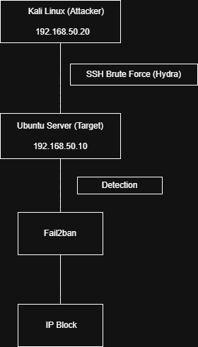

## 1. Objetivo

Este laboratorio complementario tiene como objetivo desplegar un entorno aislado para practicar hardening de un servidor Linux, auditoría de seguridad y validación mediante ataques controlados.

Se utilizan dos máquinas virtuales:

- Ubuntu-Target-Hardening: servidor objetivo
- Kali-Attack-Lab: máquina atacante

La finalidad es trabajar de forma separada al laboratorio principal, evitando modificar la arquitectura del proyecto principal y permitiendo documentar un caso práctico específico de hardening de host.

---

# 2. Arquitectura del laboratorio

| Máquina | IP | Función |
|------|------|------|
| Ubuntu-Target-Hardening | 192.168.50.10 | Servidor objetivo |
| Kali-Attack-Lab | 192.168.50.20 | Máquina atacante |

---

# 3. Preparación del entorno

## 3.1 Configuración de red de la máquina objetivo

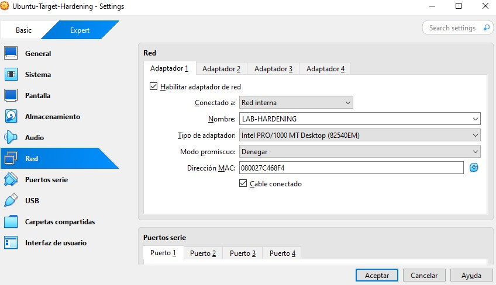

## 3.2 Configuración de red de la máquina atacante

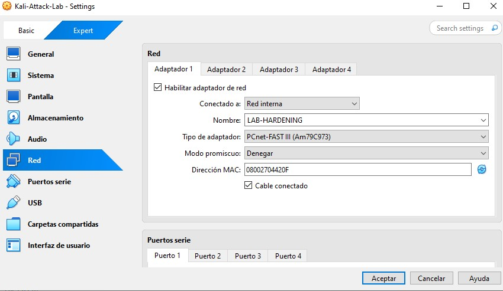

## 3.3 Dirección IP del servidor Ubuntu

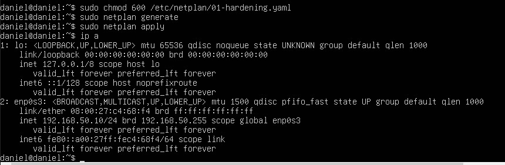

## 3.4 Dirección IP de Kali

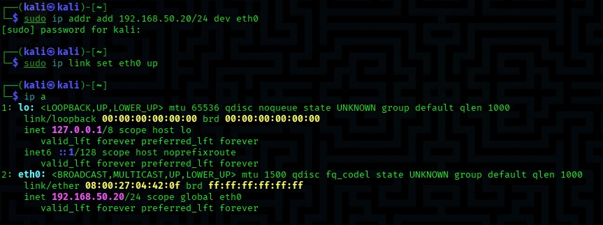

## 3.5 Validación de conectividad

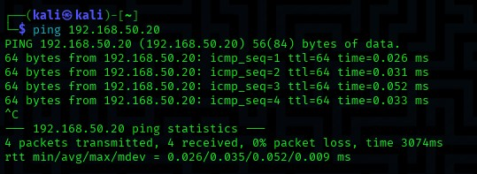

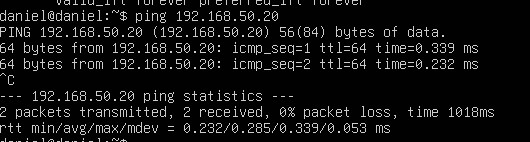

---

# 4. Instalación del sistema y servicios

## 4.1 Actualización del sistema

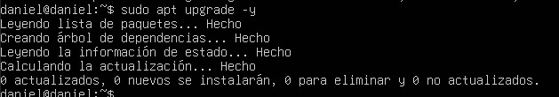

## 4.2 Instalación de servicios básicos

Se instalan los servicios necesarios para el laboratorio:

- Apache
- SSH
- MariaDB

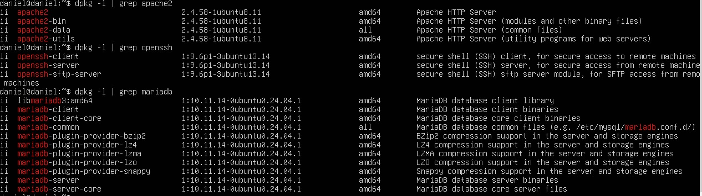

## 4.3 Verificación de servicios en ejecución

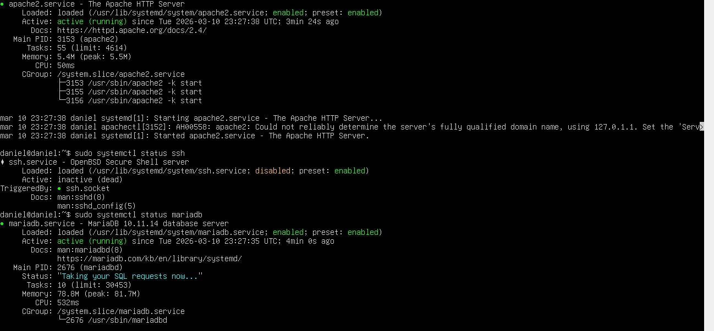

---

# 5. Reconocimiento del servidor

## 5.1 Verificación de puertos abiertos

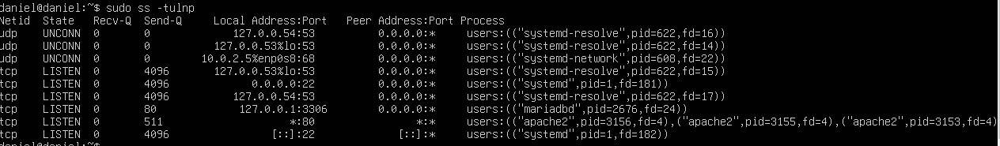

## 5.2 Escaneo inicial desde Kali

Se realiza un escaneo con Nmap desde la máquina atacante para identificar los servicios expuestos.

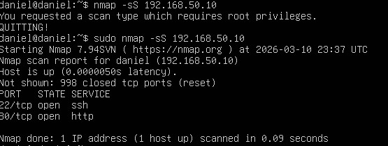

---

# 6. Auditoría inicial de seguridad

Se realiza una auditoría del sistema con **Lynis** para obtener una línea base de seguridad antes de aplicar hardening.

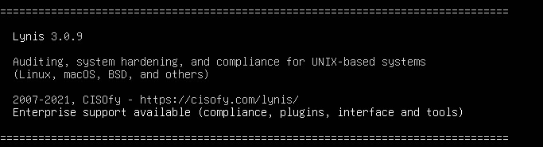

---

# 7. Simulación de ataque de fuerza bruta

## 7.1 Instalación de Hydra en Kali

Hydra se utiliza para realizar ataques de fuerza bruta contra el servicio SSH.

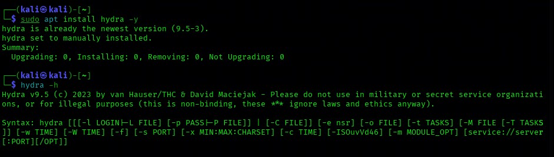

## 7.2 Creación de diccionario de contraseñas

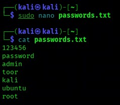

## 7.3 Inicio del ataque de fuerza bruta

Se ejecuta Hydra contra el servicio SSH del servidor Ubuntu.

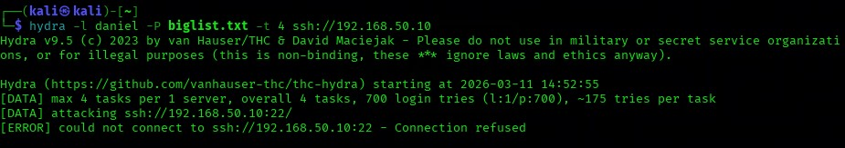

---

# 8. Detección del ataque

## 8.1 Registro del ataque en logs del sistema

Los intentos fallidos de autenticación quedan registrados en `/var/log/auth.log`.

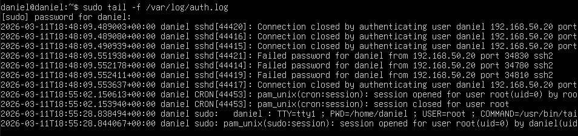

---

# 9. Defensa automática con Fail2ban

Fail2ban detecta múltiples intentos fallidos y bloquea automáticamente la IP atacante.

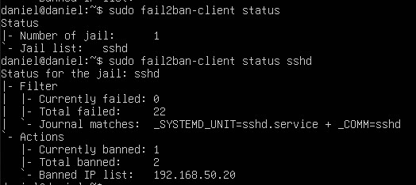

## 9.1 Verificación del bloqueo

Se verifica que la máquina atacante ya no puede conectarse al servicio SSH.

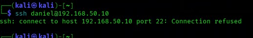

---

# 10. Validación final del hardening

Se ejecuta nuevamente Lynis para evaluar el estado del sistema tras aplicar las medidas de seguridad.

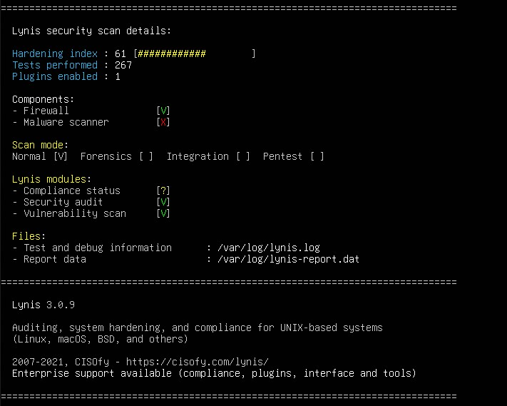

---

# 11. Conclusiones

Este laboratorio demuestra un flujo completo de seguridad ofensiva y defensiva:

1. Creación de entorno de laboratorio aislado
2. Instalación de servicios en un servidor Linux
3. Reconocimiento de servicios mediante escaneo
4. Simulación de ataque de fuerza bruta
5. Registro del ataque en logs del sistema
6. Implementación de Fail2ban para defensa automática
7. Bloqueo del atacante tras múltiples intentos fallidos
8. Validación del estado del sistema mediante auditoría de seguridad

Este escenario reproduce un flujo típico de **detección y respuesta utilizado en entornos SOC y Blue Team**, permitiendo observar cómo un sistema Linux puede detectar y mitigar ataques de fuerza bruta.

## Tools Used

- VirtualBox
- Ubuntu Server
- Kali Linux
- Nmap
- Hydra
- Fail2ban
- Lynis
- OpenSSH
- Apache

## Skills Demonstrated

- Linux server administration
- SSH hardening
- Brute force attack simulation
- Security log analysis
- Intrusion detection
- Automated incident response
- Host hardening validation
