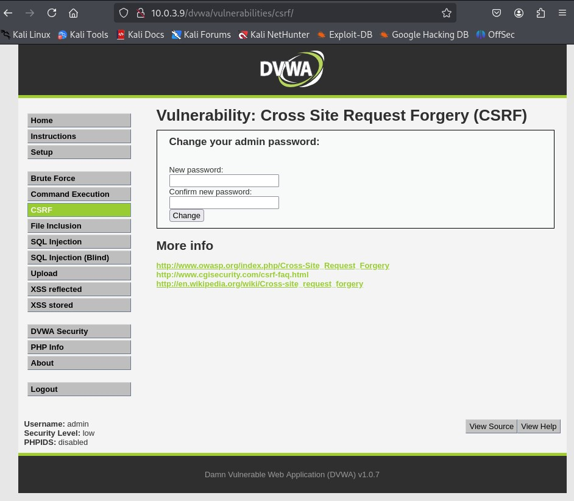
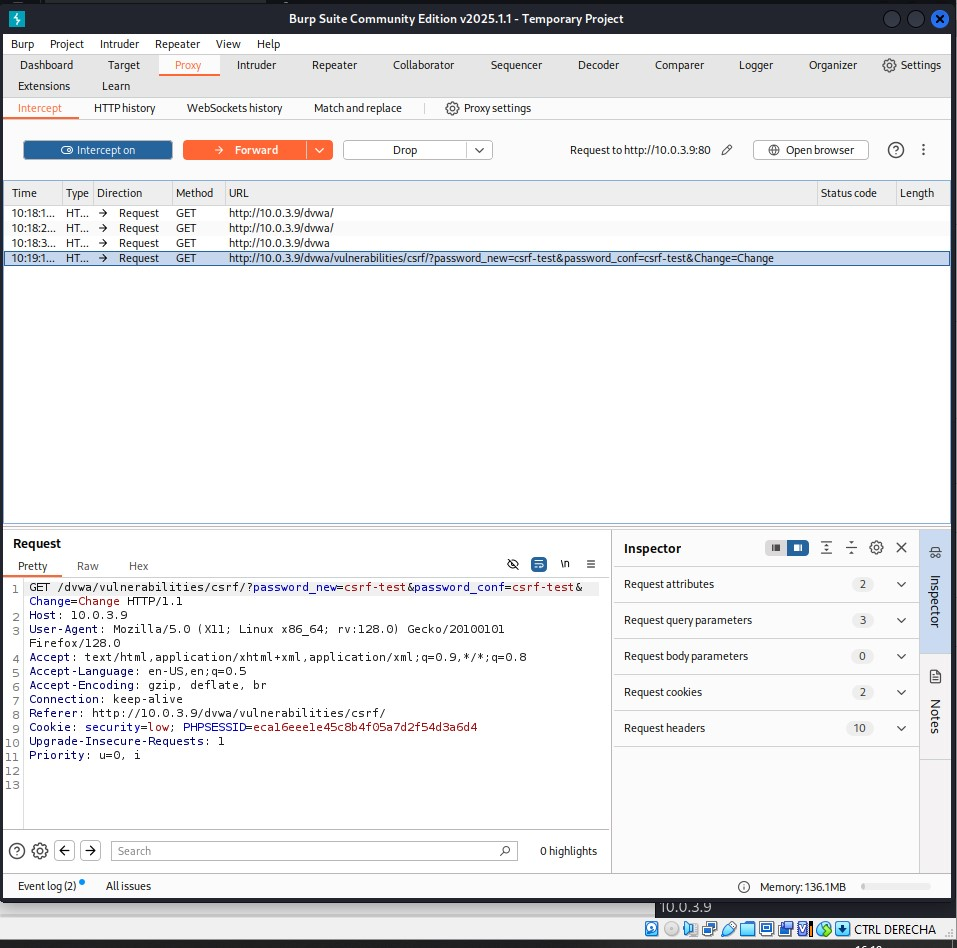
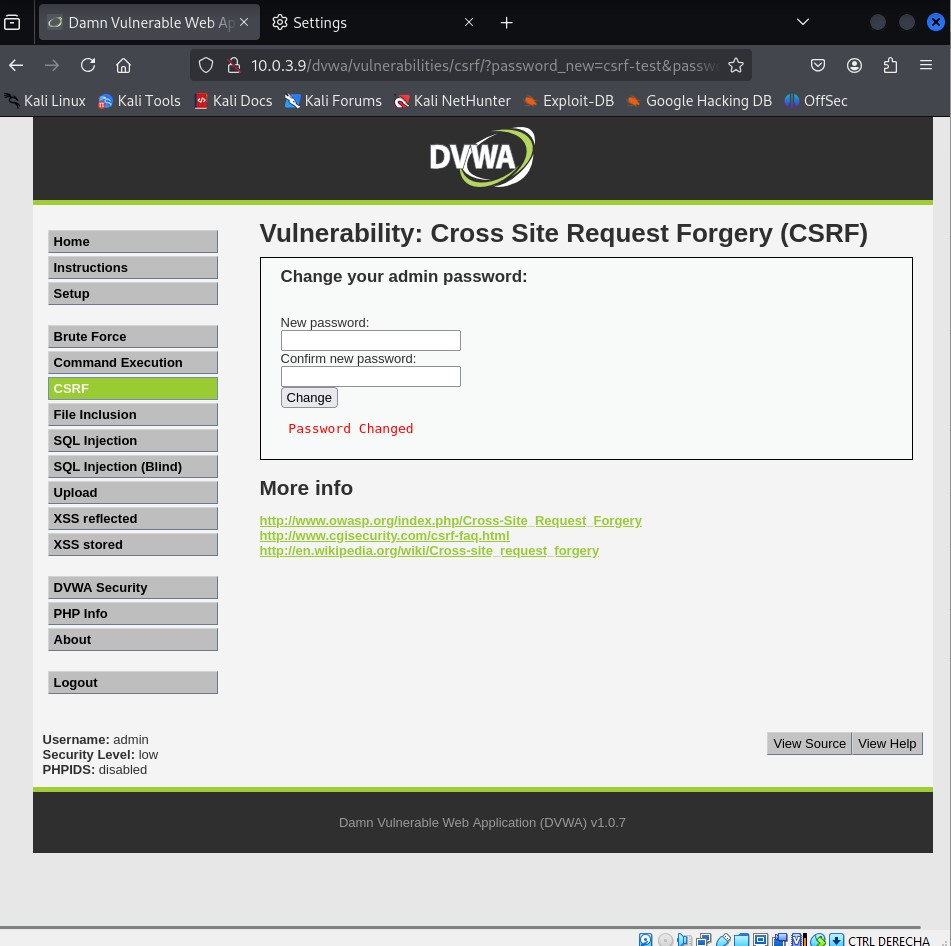

# OWASP Top 10 - DVWA Lab

## Descripción

Este laboratorio tiene como objetivo practicar de forma controlada las principales vulnerabilidades incluidas en **OWASP Top 10** utilizando **Damn Vulnerable Web Application (DVWA)**.

Para ello se desplegó un entorno compuesto por una máquina **Kali Linux** como atacante y un servidor **Ubuntu Server** con Apache, PHP, MariaDB y DVWA.

Durante el laboratorio se explotaron distintas vulnerabilidades web documentando cada una de ellas mediante capturas de pantalla y proponiendo sus correspondientes medidas de mitigación.

---

# Objetivos

- Instalar y configurar DVWA.
- Configurar un laboratorio de pentesting web.
- Practicar vulnerabilidades OWASP Top 10.
- Utilizar Burp Suite para interceptar peticiones HTTP.
- Comprender el impacto de las vulnerabilidades web.
- Documentar evidencias de explotación.
- Proponer medidas de mitigación.

---

# Tecnologías utilizadas

- Kali Linux
- Ubuntu Server
- Apache2
- PHP
- MariaDB
- DVWA
- Burp Suite
- Firefox
- VirtualBox

---

# Arquitectura del laboratorio

```text
                 +----------------------+
                 |      Kali Linux      |
                 |    Burp Suite        |
                 |      Firefox         |
                 +----------+-----------+
                            |
                      HTTP Requests
                            |
                            |
                 +----------v-----------+
                 |    Ubuntu Server     |
                 | Apache + PHP + DVWA  |
                 |      MariaDB         |
                 +----------------------+
```

---

# Instalación

Se instaló un servidor Ubuntu con un entorno LAMP compuesto por Apache, PHP y MariaDB.

Posteriormente se descargó DVWA desde GitHub, se configuró la base de datos y se modificó el archivo `config.inc.php` para completar la instalación.

Finalmente se verificó el acceso a la aplicación desde Kali Linux y se estableció el nivel de seguridad en **Low** para realizar las pruebas.

## Evidencias

### Instalación completada


### Nivel de seguridad


---

# Vulnerabilidades Analizadas

## CSRF (Cross Site Request Forgery)

Se realizó una petición HTTP manipulada para modificar la contraseña de otro usuario sin su consentimiento.

### Evidencias








### Mitigación

- Uso de Tokens CSRF.
- Cookies SameSite.
- Validación del encabezado Origin.

---

## Cross Site Scripting (XSS)

Se ejecutó código JavaScript dentro del navegador de la víctima aprovechando una validación insuficiente de entradas.

### Evidencias


### Mitigación

- Escape de caracteres.
- Validación de entradas.
- Content Security Policy (CSP).

---

## SQL Injection

Se explotó una vulnerabilidad SQL Injection para acceder a información de la base de datos.

Payload utilizado:

```sql
1' OR '1'='1
```

### Evidencias


### Mitigación

- Consultas preparadas.
- ORM.
- Validación de entradas.

---

## Command Injection

Se ejecutaron comandos del sistema operativo desde la aplicación web.

Payload utilizado:

```bash
127.0.0.1 && whoami
```

### Evidencias


### Mitigación

- Validación estricta de entradas.
- Uso de listas blancas.
- Evitar llamadas directas al sistema operativo.

## File Upload

Se aprovechó una validación insuficiente para subir un archivo PHP al servidor.

### Evidencias


### Mitigación

- Validar extensión y MIME Type.
- Almacenar archivos fuera del directorio público.
- Renombrar automáticamente los archivos subidos.

---

## Local File Inclusion (LFI)

Se explotó una vulnerabilidad LFI para acceder al archivo `/etc/passwd` del sistema Linux.

Payload utilizado:

```text
../../../../../../etc/passwd
```

### Evidencias


### Mitigación

- Validar rutas.
- Evitar includes dinámicos controlados por el usuario.
- Limitar los directorios accesibles.

---

## Weak Session IDs

Se revisó el comportamiento de las cookies de sesión para comprobar la generación de identificadores.

### Evidencias


### Mitigación

- IDs aleatorios criptográficamente seguros.
- Regenerar la sesión tras autenticarse.
- Cookies Secure y HttpOnly.

---

## PHP Info

Se analizó la información expuesta por `phpinfo()` para identificar versiones y configuración del servidor.

### Evidencias


### Mitigación

- Eliminar phpinfo() en producción.
- Ocultar versiones.
- Reducir la información expuesta.

---

## Open HTTP Redirect

Se revisó el funcionamiento del laboratorio de redirecciones abiertas.

### Evidencias


### Mitigación

- Validar URLs de destino.
- Utilizar listas blancas.
- Evitar redirecciones controladas por el usuario.

---

## Cryptography

Se revisó el laboratorio relacionado con fallos criptográficos.

### Evidencias


### Mitigación

- HTTPS.
- Algoritmos robustos.
- Gestión segura de claves.

---

## Security Logging

Se revisaron los registros generados por Apache después de realizar las pruebas.

### Evidencias


### Mitigación

- Centralizar logs.
- Configurar alertas.
- Integración con SIEM.

---

# Competencias adquiridas

- OWASP Top 10
- DVWA
- Web Application Security
- Burp Suite
- SQL Injection
- Command Injection
- Cross Site Scripting (XSS)
- CSRF
- File Upload
- Local File Inclusion
- Session Management
- Security Logging
- Pentesting Web

---

# Conclusiones

Este laboratorio permitió comprender de forma práctica el funcionamiento de las principales vulnerabilidades incluidas en OWASP Top 10.

Durante las pruebas se utilizaron diferentes técnicas de explotación sobre un entorno controlado, identificando su impacto y analizando las principales medidas de mitigación que deberían aplicarse en aplicaciones web reales.

El laboratorio constituye una excelente base para continuar aprendiendo técnicas de pentesting web y análisis de vulnerabilidades en aplicaciones.

---

# Referencias

- https://owasp.org/www-project-top-ten/
- https://github.com/digininja/DVWA
- https://portswigger.net/burp
- https://owasp.org/www-project-web-security-testing-guide/

---

# Autor

Daniel Driss

SOC Analyst | Cybersecurity Student | Blue Team