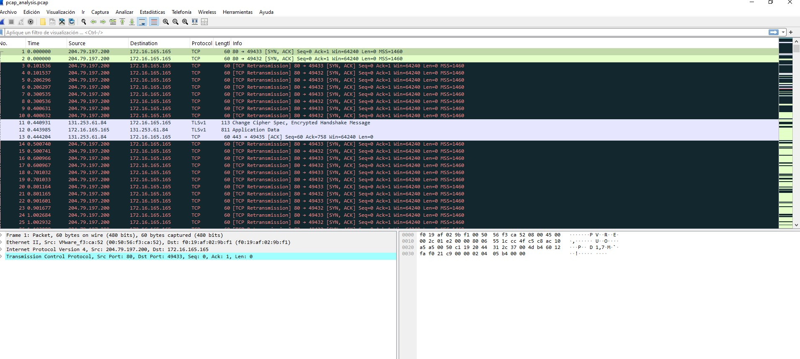
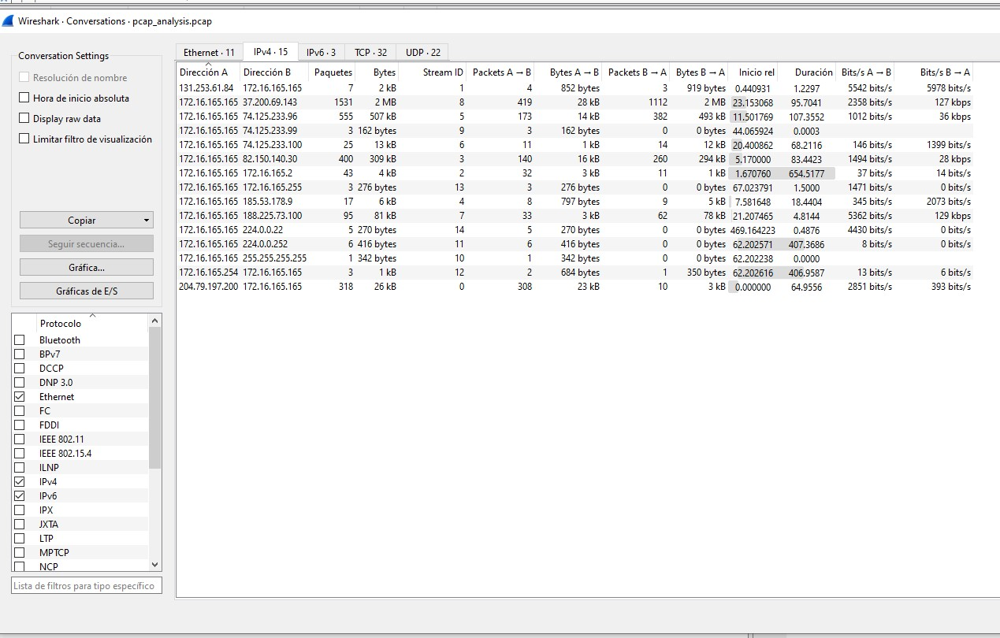
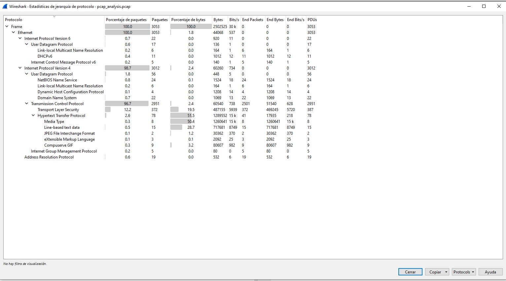
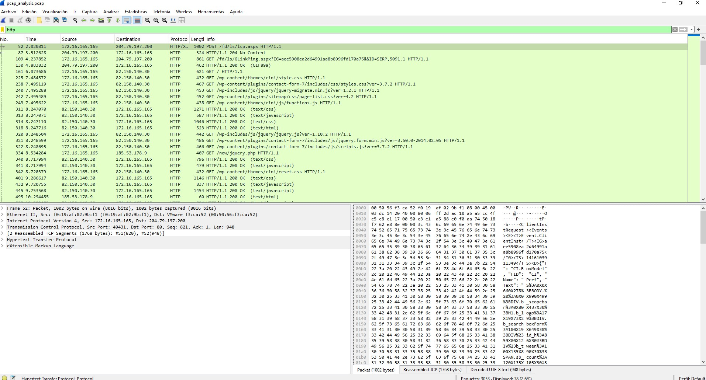
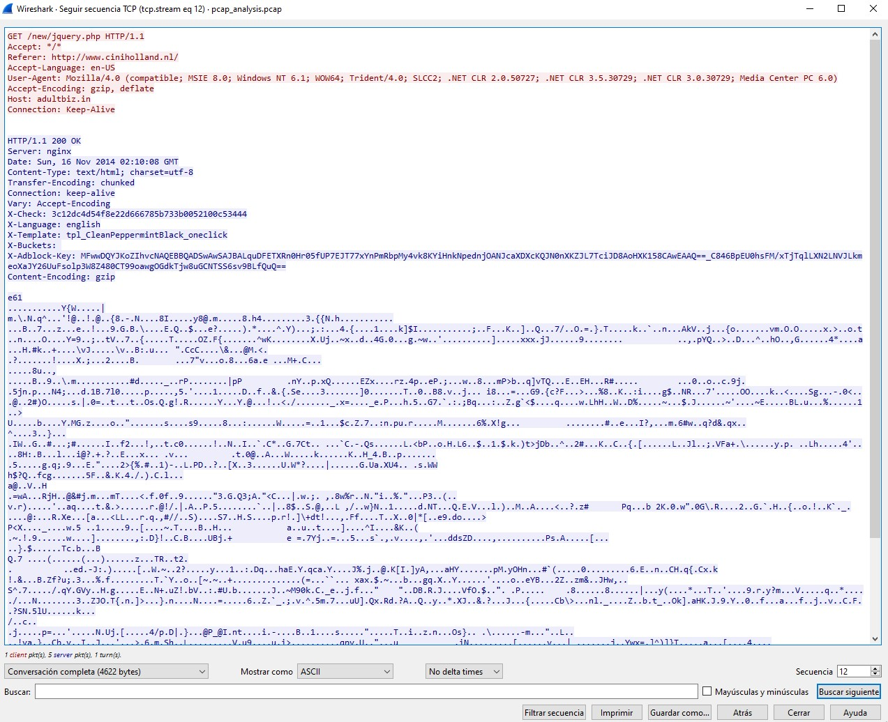
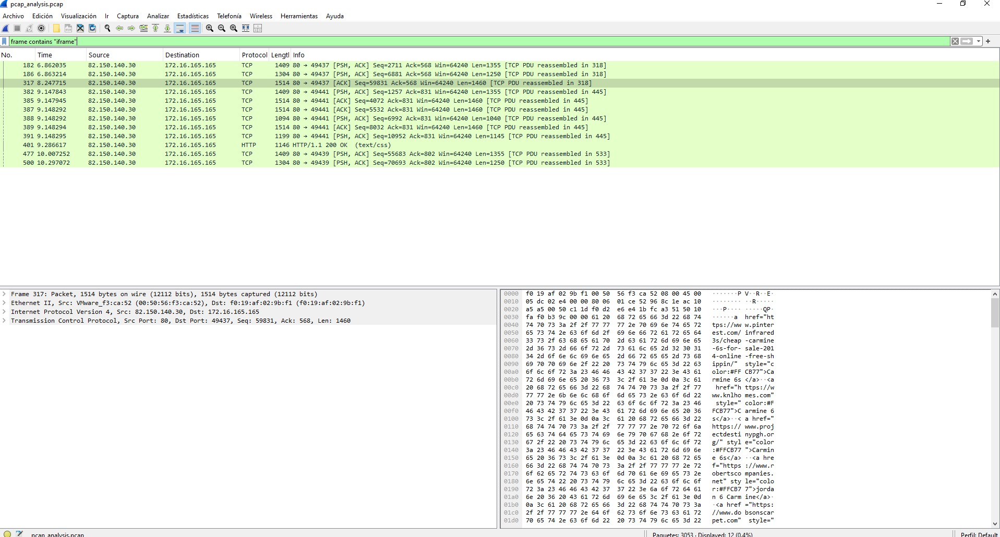
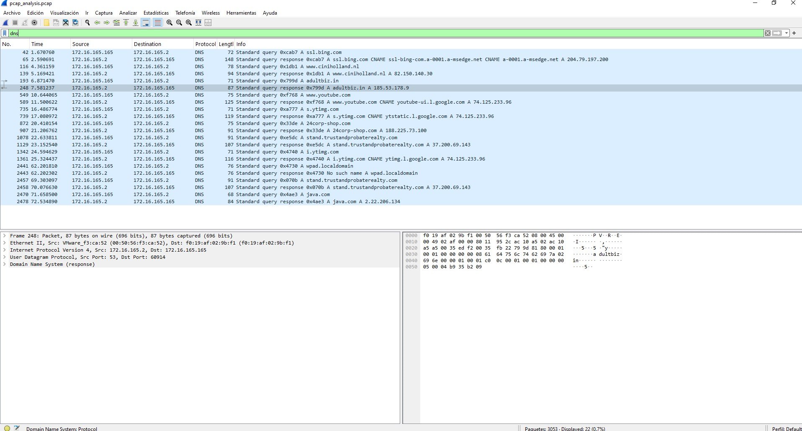
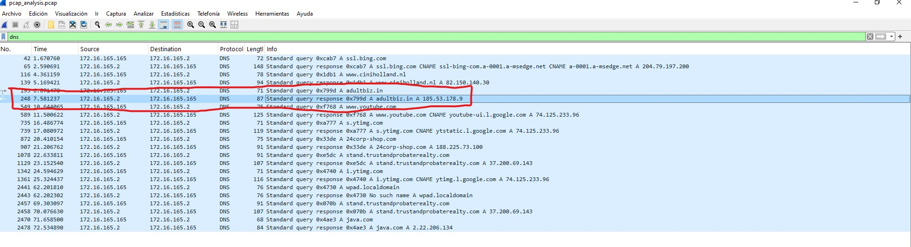

# Deployment — PCAP Malware Analysis Lab

## 1. Objetivo

El objetivo de este laboratorio es realizar un análisis de tráfico de red utilizando un archivo PCAP con el fin de identificar actividad sospechosa, conexiones externas, posibles indicadores de compromiso (IOC) y evidencias de infección mediante tráfico HTTP y DNS.

El laboratorio se centra en el análisis forense de tráfico de red utilizando Wireshark para reconstruir el comportamiento de una posible máquina comprometida y detectar elementos relacionados con malware delivery y contenido web malicioso.

---

## 2. Introducción al análisis PCAP

Los archivos PCAP contienen capturas completas de tráfico de red y son una de las fuentes más importantes en investigaciones SOC y DFIR.

Mediante el análisis de tráfico es posible:

- identificar hosts comprometidos
- reconstruir comunicaciones
- detectar malware
- identificar conexiones remotas
- descubrir dominios maliciosos
- analizar navegación web
- detectar payloads y redirecciones

El análisis de PCAP es una de las tareas fundamentales dentro de un SOC y de cualquier proceso de respuesta ante incidentes.

---

## 3. Herramientas utilizadas

Durante este laboratorio se ha utilizado:

- Wireshark
- Archivo PCAP proporcionado como evidencia

Wireshark permite:
- inspeccionar paquetes
- reconstruir sesiones TCP
- analizar protocolos
- filtrar tráfico
- identificar IOC

---

## 4. Carga inicial del tráfico

Se abrió el archivo PCAP en Wireshark para comenzar el análisis inicial del tráfico capturado.

### Evidencia inicial



En esta captura se observa el tráfico general de la captura, incluyendo múltiples conexiones TCP y tráfico HTTP.

---

## 5. Identificación del host sospechoso

Posteriormente se analizaron las conversaciones IPv4 para identificar el host con mayor actividad dentro de la red.

Para ello se utilizó:

```text
Estadísticas → Conversaciones
```

### Evidencia de conversaciones IPv4



Durante el análisis se observó que la IP:

```text
172.16.165.165
```

mantenía múltiples conexiones externas y generaba gran parte del tráfico analizado.

Debido a ello, esta dirección fue identificada como el principal host sospechoso de la investigación.

---

## 6. Análisis de protocolos

Se realizó un análisis de jerarquía de protocolos para identificar qué protocolos de capa de aplicación aparecían dentro del tráfico.

Para ello se utilizó:

```text
Estadísticas → Jerarquía de protocolo
```

### Evidencia de protocolos



Durante el análisis se identificaron principalmente:

- HTTP
- TLS
- DNS
- TCP

Además, también aparecieron:
- XML
- JPEG
- GIF
- contenido multimedia

La presencia de HTTP resultó especialmente relevante debido a que gran parte de la actividad sospechosa se encontraba asociada a navegación web.

---

## 7. Análisis de tráfico HTTP

Posteriormente se filtró el tráfico HTTP para identificar peticiones sospechosas y posibles dominios maliciosos.

Filtro utilizado:

```text
http
```

### Evidencia de tráfico HTTP



Durante el análisis se identificaron múltiples peticiones HTTP realizadas por la máquina sospechosa hacia servidores externos.

Una de las peticiones más relevantes fue:

```text
GET /new/jquery.php HTTP/1.1
```

Este recurso resultó especialmente sospechoso debido a:
- nombre poco habitual
- contenido dinámico
- tráfico asociado a dominios externos

---

## 8. Reconstrucción de sesión TCP

Se realizó un seguimiento de la comunicación TCP utilizando:

```text
Seguir → Flujo TCP
```

Esto permitió reconstruir el contenido completo de la sesión HTTP sospechosa.

### Evidencia de Follow TCP Stream



Durante el análisis se identificó el dominio:

```text
adultbiz.in
```

Además, también apareció:

```text
Referer: http://www.ciniholland.nl/
```

Esto indica que la petición sospechosa fue originada desde dicha página web.

La respuesta HTTP mostraba contenido comprimido y datos potencialmente ofuscados, indicando posible actividad relacionada con malware delivery.

---

## 9. Búsqueda de contenido oculto

Se realizaron búsquedas relacionadas con contenido HTML sospechoso utilizando el filtro:

```text
frame contains "iframe"
```

### Evidencia de contenido HTML sospechoso



Durante el análisis se localizaron múltiples referencias HTML y enlaces externos embebidos dentro del tráfico HTTP.

La presencia de este tipo de contenido suele estar relacionada con:
- iframes ocultos
- redirecciones maliciosas
- carga de contenido externo
- campañas de malware web

---

## 10. Análisis DNS

Posteriormente se analizaron las peticiones DNS realizadas por la máquina sospechosa.

Filtro utilizado:

```text
dns
```

### Evidencia DNS



Durante el análisis se identificaron múltiples resoluciones DNS relacionadas con:
- navegación web
- dominios externos
- posibles IOC

Entre ellas destacó especialmente:

```text
adultbiz.in
```

resuelto hacia:

```text
185.53.178.9
```

También se identificó:

```text
www.ciniholland.nl
```

resuelto hacia:

```text
82.150.140.30
```

---

## 11. Identificación de IOC

Finalmente, se recopilaron los principales indicadores de compromiso detectados durante la investigación.

### Evidencia IOC



### IOC identificados

#### Host sospechoso

```text
172.16.165.165
```

#### Dominio sospechoso

```text
adultbiz.in
```

#### IP asociada al dominio

```text
185.53.178.9
```

#### Página origen

```text
www.ciniholland.nl
```

#### Servidor relacionado

```text
82.150.140.30
```

---

## 12. Conclusiones técnicas

Durante este laboratorio se realizó un análisis completo de tráfico de red utilizando Wireshark sobre un archivo PCAP con actividad sospechosa.

El análisis permitió:

- identificar el host comprometido
- detectar tráfico HTTP sospechoso
- analizar sesiones TCP
- identificar dominios maliciosos
- localizar IOC
- analizar resoluciones DNS
- reconstruir parte de la cadena de infección

Además, se comprobó el enorme valor del análisis PCAP dentro de entornos SOC y DFIR para:
- investigaciones de malware
- análisis post-incidente
- threat hunting
- análisis de comunicaciones maliciosas

Este tipo de investigaciones representa una de las tareas más habituales dentro de equipos de análisis de seguridad y respuesta ante incidentes.