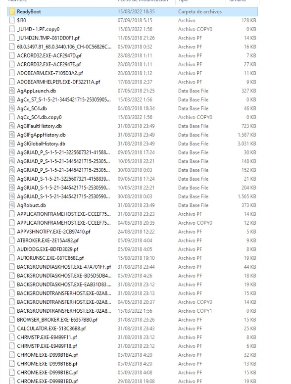
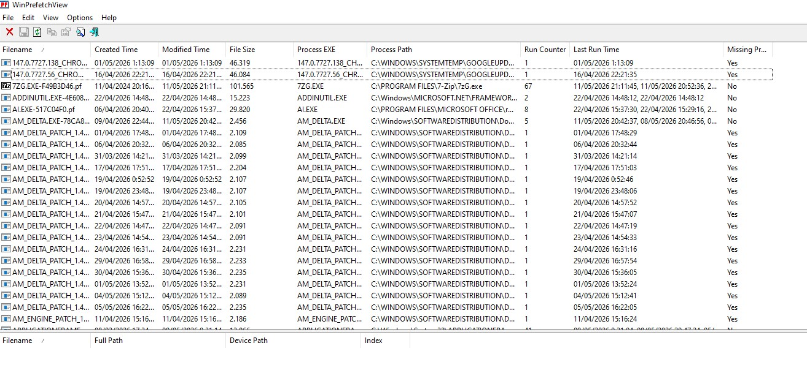
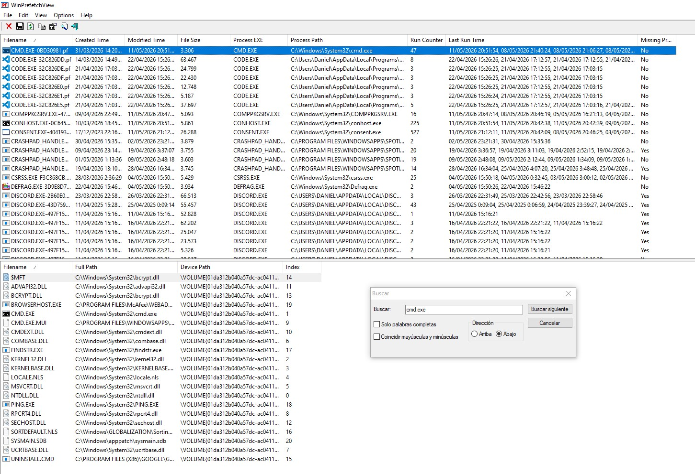
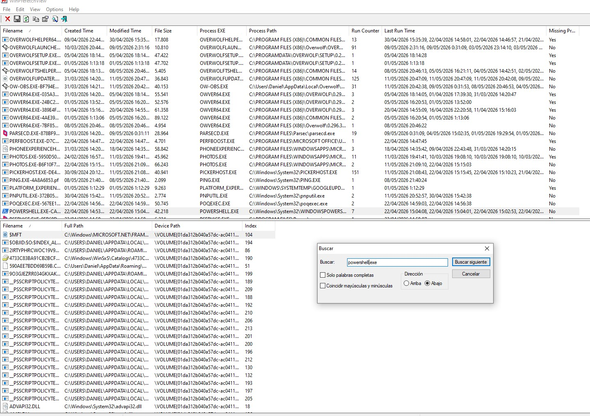
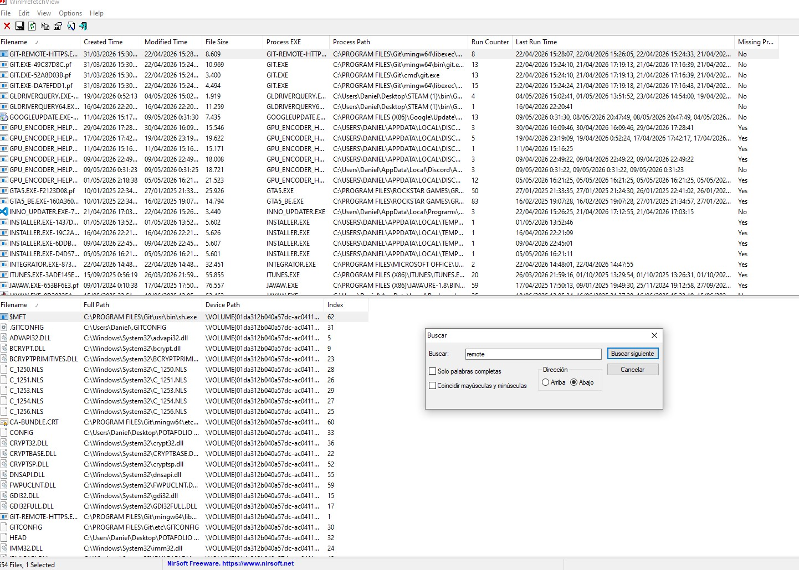
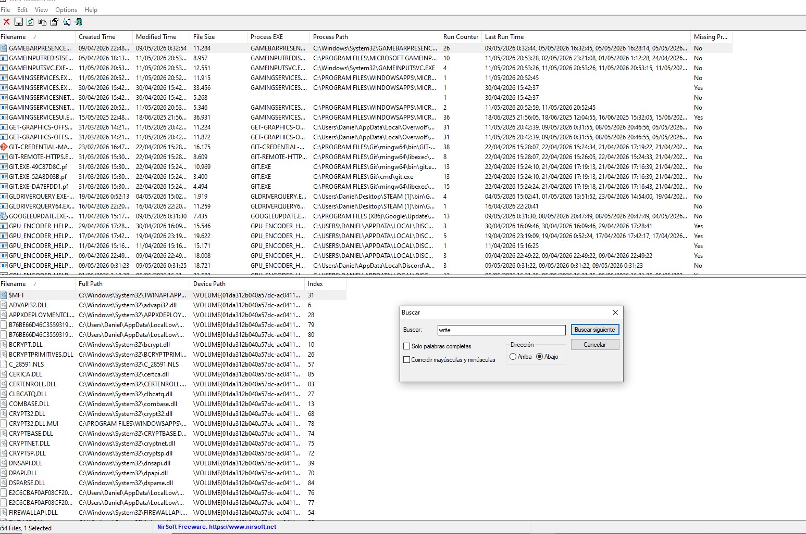
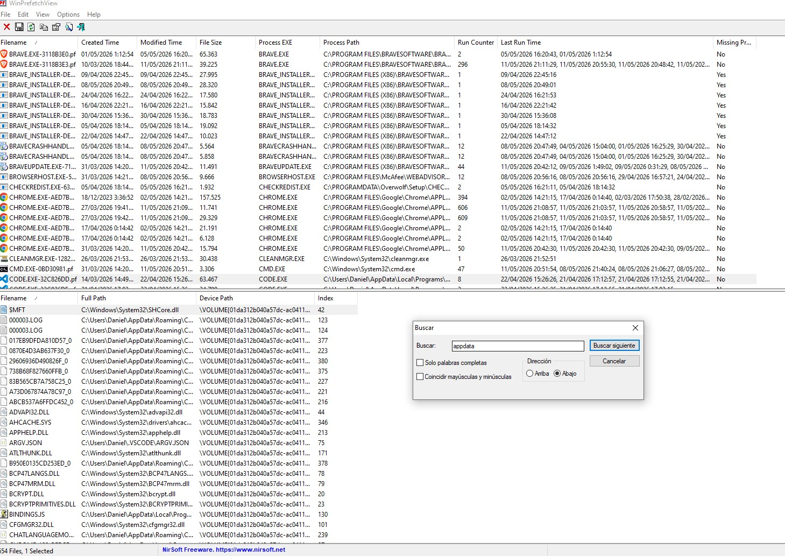
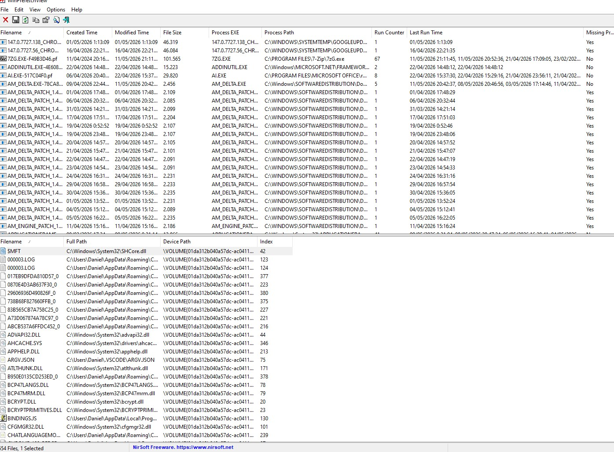

# Deployment — Prefetch Forensics Lab

## 1. Objetivo

El objetivo de este laboratorio es realizar un análisis forense básico sobre artefactos Prefetch de Windows con el fin de identificar programas ejecutados, actividad sospechosa y posibles trazas de persistencia o ejecución remota.

El laboratorio se centra en el análisis de evidencias reales obtenidas de un sistema Windows, utilizando herramientas de parsing para reconstruir actividad del sistema y generar una línea temporal básica de ejecución.

---

## 2. Introducción a Prefetch

Prefetch es un mecanismo de optimización de Windows diseñado para acelerar la carga de aplicaciones utilizadas frecuentemente.

Cuando un programa se ejecuta por primera vez, Windows genera un archivo `.pf` dentro del directorio:

```text
C:\Windows\Prefetch
```

Estos archivos almacenan información relacionada con:

- Nombre del ejecutable
- Número de ejecuciones
- Fechas de ejecución
- DLLs cargadas
- Archivos utilizados
- Rutas internas

Aunque Prefetch fue diseñado para mejorar el rendimiento del sistema, también posee un gran valor en análisis forense digital (DFIR), ya que permite reconstruir actividad histórica de ejecución incluso cuando el binario original ya no existe.

---

## 3. Valor forense de Prefetch

Los artefactos Prefetch permiten:

- Identificar programas ejecutados
- Construir timelines de actividad
- Detectar herramientas sospechosas
- Analizar persistencia
- Verificar ejecución de payloads
- Relacionar actividad de usuario y atacante

Por este motivo, Prefetch es uno de los artefactos más utilizados en investigaciones DFIR sobre sistemas Windows.

---

## 4. Entorno de análisis

Para este laboratorio se ha utilizado:

- Sistema Windows
- Evidencias proporcionadas en un archivo comprimido
- Herramienta WinPrefetchView para el parsing de artefactos

La evidencia analizada contenía múltiples archivos `.pf` correspondientes a diferentes aplicaciones ejecutadas en el sistema.

---

## 5. Preparación de evidencias

Se ha descomprimido el conjunto de evidencias y se ha localizado el directorio Prefetch.

Posteriormente, se ha realizado una primera validación visual del contenido.

### Evidencia inicial



En esta captura se observan múltiples artefactos `.pf`, indicando actividad previa en el sistema analizado.

---

## 6. Parsing de Prefetch

Para facilitar el análisis se ha utilizado la herramienta WinPrefetchView, permitiendo visualizar:

- Nombre del ejecutable
- Fechas de creación
- Fechas de modificación
- Número de ejecuciones
- Última ejecución
- Ruta del proceso

### Vista general del análisis



Esta herramienta permite convertir los artefactos Prefetch en información fácilmente interpretable durante el análisis forense.

---

## 7. Análisis de actividad sospechosa

### 7.1 Actividad CMD

Durante el análisis se identificó actividad asociada a `CMD.EXE`.

### Evidencia CMD



Se observó:

- múltiples ejecuciones
- alta frecuencia de uso
- actividad reciente

La presencia reiterada de CMD puede indicar tareas administrativas legítimas o actividad manual del atacante.

---

### 7.2 Actividad PowerShell

También se localizaron trazas asociadas a `POWERSHELL.EXE`.

### Evidencia PowerShell



Durante el análisis se observaron referencias relacionadas con:

```text
__PSSCRIPTPOLICYTEST
```

Este tipo de artefactos suele aparecer durante:
- ejecución de scripts
- comprobaciones de políticas de ejecución
- automatización mediante PowerShell

Debido a ello, PowerShell representa uno de los vectores más utilizados por atacantes para:
- persistencia
- descarga de payloads
- ejecución remota
- automatización maliciosa

---

## 8. Investigación de conexiones remotas

Se realizaron búsquedas relacionadas con actividad remota y protocolos RDP.

### Evidencia de actividad remota



No se encontraron trazas directas de:
- `MSTSC.EXE`
- `RDPCLIP.EXE`

Sin embargo, sí se observaron referencias relacionadas con conexiones HTTPS remotas mediante:

```text
GIT-REMOTE-HTTPS
```

Esto evidencia actividad de comunicación remota a través de protocolos HTTPS.

---

## 9. Análisis de documentos y aplicaciones

Durante la investigación se buscaron evidencias relacionadas con Microsoft Word y WordPad.

### Evidencia WordPad / WRITE



No se localizaron evidencias directas de `WINWORD.EXE`.

Sin embargo, sí aparecieron referencias asociadas a:

```text
WRITE.EXE
```

correspondiente a WordPad en determinadas versiones de Windows.

Esto indica actividad relacionada con edición o visualización de documentos mediante herramientas integradas del sistema.

---

## 10. Persistencia y artefactos sospechosos

Se analizaron rutas asociadas a:

- AppData
- Temp
- Roaming
- Scripts
- PowerShell

### Evidencia de persistencia



Las rutas dentro de `AppData` son especialmente relevantes en análisis DFIR debido a que muchos payloads y mecanismos de persistencia utilizan dichas ubicaciones para evitar detección.

---

## 11. Exportación de resultados

Finalmente, se exportó el conjunto completo de artefactos analizados a formato CSV para facilitar su revisión y correlación posterior.

Archivo generado:

```text
prefetch-analysis.csv
```

### Evidencia final del análisis



Esta exportación permite trabajar posteriormente con:
- timelines
- filtrado de eventos
- correlación de actividad
- análisis automatizado

---

## 12. Conclusiones técnicas

El análisis de artefactos Prefetch permite reconstruir gran parte de la actividad histórica de un sistema Windows.

Durante este laboratorio se identificaron:
- ejecuciones frecuentes de CMD
- actividad PowerShell
- referencias a scripts
- actividad remota HTTPS
- uso de aplicaciones integradas del sistema
- rutas potencialmente relacionadas con persistencia

Además, se comprobó el valor de Prefetch como fuente de información en investigaciones DFIR, especialmente para:
- reconstrucción temporal
- identificación de herramientas utilizadas
- detección de actividad sospechosa
- análisis post-incidente

Este tipo de análisis representa una de las técnicas fundamentales en entornos de respuesta ante incidentes y análisis forense digital sobre sistemas Windows.